**Authors**: [Alberto F. Martin](https://research.monash.edu/en/persons/alberto-f-martin), [Santiago Badia](https://research.monash.edu/en/persons/santiago-badia-rodriguez)

<a rel="license" href="http://creativecommons.org/licenses/by-nc-sa/4.0/"></a><br />This work is licensed under a <a rel="license" href="http://creativecommons.org/licenses/by-nc-sa/4.0/">Creative Commons Attribution-NonCommercial-ShareAlike 4.0 International License</a>.
<!-- TOC -->

- [1. Introduction to Version control](https://en.wikipedia.org/wiki/Versioncontrol) using [Git (*2h 40min*).](#1-introduction-to-version-controlhttpsenwikipediaorgwikiversioncontrol-using-git-2h-40min)
    - [1.1. Version Control in a nutshell](#11-version-control-in-a-nutshell)
    - [1.2. Why Git?](#12-why-git)
    - [1.3. Accessing Git and our first Git command](#13-accessing-git-and-our-first-git-command)
    - [1.4. Initial configuration options](#14-initial-configuration-options)
    - [1.5. Creating a **local** Git repository](#15-creating-a-local-git-repository)
    - [1.6. The concept of staging area. Creating our first commit](#16-the-concept-of-staging-area-creating-our-first-commit)
    - [1.7. Modifying an already tracked file. Viewing the diff](#17-modifying-an-already-tracked-file-viewing-the-diff)
    - [1.8. Backing up and shipping the local repository on GitHub](#18-backing-up-and-shipping-the-local-repository-on-github)
        - [1.8.1. Creating an account on GitHub](#181-creating-an-account-on-github)
        - [1.8.2. Connecting to GitHub with SSH keys](#182-connecting-to-github-with-ssh-keys)
        - [1.8.3. Creating a new GitHub project (and associated Git repository)](#183-creating-a-new-github-project-and-associated-git-repository)
        - [1.8.4. Pushing into the remote Git repository at GitHub](#184-pushing-into-the-remote-git-repository-at-github)
    - [1.9. Cloning a remote repository](#19-cloning-a-remote-repository)
    - [1.10. Working alone. The commit+push cycle](#110-working-alone-the-commitpush-cycle)
    - [1.11. Working collaboratively](#111-working-collaboratively)
        - [1.11.1. Branching](#1111-branching)
        - [1.11.2. Push a branch to the remote repository at GitHub](#1112-push-a-branch-to-the-remote-repository-at-github)
        - [1.11.3. Create a Pull Request](#1113-create-a-pull-request)
        - [1.11.4. Merge a Pull Request](#1114-merge-a-pull-request)
        - [1.11.5. Pulling changes from the remote repository](#1115-pulling-changes-from-the-remote-repository)
        - [1.11.6. Conflicting changes](#1116-conflicting-changes)
    - [1.12. Conclusions and further references](#112-conclusions-references)
<!-- /TOC -->

# 1. Introduction to [Version control](https://en.wikipedia.org/wiki/Version_control) using [Git](https://git-scm.com/) (*2h 40min*).
<a id="markdown-introduction-to-version-controlhttpsenwikipediaorgwikiversioncontrol-using-git-2h-40min" name="introduction-to-version-controlhttpsenwikipediaorgwikiversioncontrol-using-git-2h-40min"></a>

This tutorial provides an introduction to Version Control using a particular software tool called [Git](https://en.wikipedia.org/wiki/Git). 
Git belongs to a **crucial class** of tools in the scientific coding workflow referred to as [Version Control Systems](https://en.wikipedia.org/wiki/Version_control) (VCSs). We begin by assuming that you do not know what VCSs and, in particular, Git are (or even have ever heard about them!). All you need is some basic familiarity with the Unix command-line, as Git comes in the form of a Unix-like command. Recall that in the [previous tutorial](Unix-CLI.md) we introduced you to the Unix command-line. Fortunately, this introduction is more than you need to start using Git from the command-line.
While there are [some great GUI-based tools](https://git-scm.com/downloads/guis/) that can be used on top of Git, it is more convenient to learn Git using git-specific commands first and then to try out a GUI-based format once you are more comfortable with the command.

In this tutorial we will not be too comprehensive. The advanced features of Git are tricky to learn, and are based to a large extent on theoretical concepts that are too advanced for an introductory tutorial. Instead, we will cover a minimal set of features and associated commands that let you start becoming productive with this sophisticated tool. Right at the end of the tutorial, we will point you to a set of further references that you can use to further expand your Git skills.

## 1.1. Version Control in a nutshell
<a id="markdown-version-control-in-a-nutshell" name="version-control-in-a-nutshell"></a>

A VCS is an special program that provides an **automatic and effective** way to track changes in your project files and directories. It allows you to effectively “save your work" (referred to as *"commit your work"* in VCS parlance) at selected points in the development timeline, and to view/retrieve the files and directories in the status corresponding to any of these past save points as desired.  VCSs provide an excellent automated solution to the still (surprisingly) widely-used **bad practice** of manual tracking of changes based on cumbersome file naming conventions. This is better illustrated graphically with the "notFinal.doc" comic by Jorge Cham available [here](http://phdcomics.com/comics/archive.php?comicid=1531). It is clearly not practical to have multiple nearly-identical versions of the same document with such cumbersome file names. Nowadays, applications like
[Microsoft Word](https://support.office.com/en-us/article/Track-changes-in-Word-197ba630-0f5f-4a8e-9a77-3712475e806a), [Google Docs](https://support.google.com/docs/answer/190843?hl=en), or [LibreOffice](https://help.libreoffice.org/Common/Recording_and_Displaying_Changes) do offer built-in version tracking, but such features are tightly coupled to the underlying application and are not useful for other document types.

Beyond this, modern VCSs allow you to **develop disruptive, speculative features** without affecting the main development trunk. Besides, with a VCS, you can keep **remote, offsite backups** of your project files and history, e.g., using a repository hosting service in the Cloud such as [GitHub](https://github.com/). You have perhaps had the unhappy experience of **losing work**, e.g., by accidentally removing it, due to corrupted hard-drives, etc. Although it is still possible to loose data using a VCS, the probability and amount of data loss are minimized if one keeps a systematic and appropriate workflow while using the tool. Last but not least, a VCS lets you **collaborate easily and conveniently** with others, and to **ship your product**, i.e., to expose your work to the **public domain**. However, teams are not the only ones to benefit from version control. If you are working alone on a project, say a class assignment, you can benefit immensely as well. 
Keeping track of what was changed, when, and why, is extremely helpful if you interrupt the project development and return to it later on, when most probably your memory has become fuzzy and unreliable.  

VCSs have evolved considerably over the years, and still nowadays, there are a number of alternatives to [Git](https://git-scm.com/). [Wikipedia](https://en.wikipedia.org/wiki/Template:Version_control_software) provides a pretty comprehensive picture of the (overwhelming) variety of past and present VCSs.  The family line leading to Git includes [RCS](https://en.wikipedia.org/wiki/Revision_Control_System), [CVS](https://en.wikipedia.org/wiki/Concurrent_Versions_System), and [SVN](https://en.wikipedia.org/wiki/Apache_Subversion), although there are timely alternatives to Git as well, such as, e.g., [Mercurial](https://en.wikipedia.org/wiki/Mercurial), or [Bazaar](https://en.wikipedia.org/wiki/GNU_Bazaar), to name a few. In contrast to RCS, CVS, SVN, which are considered nowadays outdated technology, modern VCSs, such as Git or Mercurial, are [**distributed VCSs**](https://git-scm.com/about/distributed), meaning that they do not need a centralized server to host the repository. **Every local copy of a remote repository (referred to as a "clone" in the Git parlance) is a fully working copy.** In case there is a problem with the computer originally hosting the remote repository (e.g., it becomes corrupted or lost), any local copy can recreate the full history. On the contrary, in a centralized VCS, there is a unique server that contains all changes in the project and the local copies are just light versions of it. If the server goes down, you lose all the history. 


## 1.2. Why Git?
<a id="markdown-why-git" name="why-git"></a>

There are a number of reasons ([some of them too technical](https://git-scm.com/about) to be entirely grasped at this point), but the most important are perhaps the following. Git achieves **a sound balance** among speed, efficiency, reliability, and ease-of-use. Indeed, this hallmark of Git has positioned it as undoubtedly the de-facto standard VCS  used in ([open source](https://opensource.com/resources/what-open-source)) scientific (and not necessarily scientific) software projects. Git was originally developed in 2005 by [Linus Torvalds](https://en.wikipedia.org/wiki/Linus_Torvalds), the same individual who created the Linux OS, i.e., an open source variant of Unix.  Therefore, it is also (as could not be otherwise) **[free and open source](https://git-scm.com/about/free-and-open-source)**. Since then, its popularity has increased significantly, mostly due to the development of repository hosting services in the Cloud such as  [GitHub](https://github.com/), [Gitlab](https://about.gitlab.com/), or [BitBucket](https://en.wikipedia.org/wiki/Bitbucket). Indeed, **virtually the whole state-of-the-art in open source (scientific and not necessarily scientific) software is available at these Git repository hosting services**. Finally, it is worth mentioning that Git is available on multiple platforms, including Microsoft Windows, Linux, and macOS, among others.

Git is what professionals use to keep track of what they have done and to collaborate with other people. Large software development projects rely on it, and most programmers use it for their small jobs as well. And it is not just for software: books, papers, reports, small data sets, and anything that changes over time and/or needs to be shared **should be** stored in a Git repository. Indeed, we used Git in order to track the different versions of this tutorial.

## 1.3. Accessing Git and our first Git command
<a id="markdown-accessing-git-and-our-first-git-command" name="accessing-git-and-our-first-git-command"></a>

In this tutorial we will use the Git version that is already installed along with [Cygwin](https://www.cygwin.com/) at [MoVE](https://www.monash.edu/learning-teaching/innovation/educational-technologies/move), so that we do not assume any installation prerequisite on your Laptop or Desktop. 
See instructions [available here](./Unix-CLI.md#112-running-a-terminal) in order to launch a Cygwin terminal. In any case, if you wish to install Git on your system, you can follow the instructions available [here](https://git-scm.com/book/en/v2/Getting-Started-Installing-Git). 

All Git commands are of the form `git command [arguments]`, where `command` is the git command to be executed, i.e., what we actually want to do, and `arguments` is an (optional) list of arguments which may be needed for the particular `command` at hand. That said, let us type our first command. In particular, `git help`, which by itself is quite helpful as it gives general guidelines on Git usage:

```bash
$ git help
usage: git [--version] [--help] [-C <path>] [-c <name>=<value>]
           [--exec-path[=<path>]] [--html-path] [--man-path] [--info-path]
           [-p | --paginate | -P | --no-pager] [--no-replace-objects] [--bare]
           [--git-dir=<path>] [--work-tree=<path>] [--namespace=<name>]
           <command> [<args>]

These are common Git commands used in various situations:

start a working area (see also: git help tutorial)
   clone      Clone a repository into a new directory
   init       Create an empty Git repository or reinitialize an existing one

work on the current change (see also: git help everyday)
   add        Add file contents to the index
   mv         Move or rename a file, a directory, or a symlink
   reset      Reset current HEAD to the specified state
   rm         Remove files from the working tree and from the index

examine the history and state (see also: git help revisions)
   bisect     Use binary search to find the commit that introduced a bug
   grep       Print lines matching a pattern
   log        Show commit logs
   show       Show various types of objects
   status     Show the working tree status

grow, mark and tweak your common history
   branch     List, create, or delete branches
   checkout   Switch branches or restore working tree files
   commit     Record changes to the repository
   diff       Show changes between commits, commit and working tree, etc
   merge      Join two or more development histories together
   rebase     Reapply commits on top of another base tip
   tag        Create, list, delete or verify a tag object signed with GPG

collaborate (see also: git help workflows)
   fetch      Download objects and refs from another repository
   pull       Fetch from and integrate with another repository or a local branch
   push       Update remote refs along with associated objects

'git help -a' and 'git help -g' list available subcommands and some
concept guides. See 'git help <command>' or 'git help <concept>'
to read about a specific subcommand or concept.
```

Besides, when `git help` is applied to a specific command, it gives further information on that
command. For example, `git help add` shows details regarding the `git add` command (check it!). The output of `git help` very much resembles [man pages](./Unix-CLI.md#typing-our-first-commands-looking-for-help-using-man), so that it can sometimes be rather cryptic and hard to understand for non-advanced Git users. Therefore, it you struggle to understand the help messages shown by `git help`, do not panic, these are an excellent opportunities to develop your computer skills.


## 1.4. Initial configuration options
<a id="markdown-initial-configuration-options" name="initial-configuration-options"></a>

When we use Git on a new computer for the first time, we need to set up a few one-time initial configuration options. The very minimal one-time options to be set up to start using Git are: our name, our email address, and our preferred command-line text editor. This is achieved by means of the following three Git commands, respectively:

```
$ git config --global user.name "Given name(s) Family name"
$ git config --global user.email "myname@monash.edu"
$ git config --global core.editor "nano"
````

where you have to replace "`Given name(s) Family name`" by your own names, and `"myname@monash.edu"` by your actual Monash e-mail address. The values provided to the `user.name` and `user.email` options are used by Git in order to identify the changes that you perform on the repository files by your name and e-mail address. Indeed, as we will see in [Section 1.6](#16-the-concept-of-staging-area-creating-our-first-commit), each time that you save a set of changes, i.e., each time that you create a new "commit", your name and e-mail address will be associated to these changes. This becomes especially helpful when you are collaborating with others. Later on in this tutorial, we will be interacting with GitHub. Therefore, **the email address provided should ideally be the same as we will use later in order to set up your GitHub account, e.g., your Monash e-mail address**. We note that the provided names and e-mail address will be viewable in any projects that you ship to the public, e.g., in GitHub, so please do not accidentally expose any information that you would rather like to keep private.
On the other hand, the value provided to the `core.editor` tells Git which command-line editor to be used. In particular, the editor is called by Git whenever it requires that you associate a message to a newly created commit; see [Section 1.6](#16-the-concept-of-staging-area-creating-our-first-commit). In the command above, we are telling Git to use the GNU `nano` editor, which we covered in the [previous tutorial](./Unix-CLI.md#brief-introduction-to-the-gnu-nano-command-line-text-editor). Finally, it is important to mention that the three commands we just ran only need to be run once: the flag `--global` tells Git to use the settings for every project, in your user account, on this computer. You can change your configuration as many times as you want: use the same commands to choose another editor or update your email address.

> *__Note:__* As mentioned in the [previous tutorial](./Unix-CLI.md#directory-structure), the contents of the home directory might vary among different Cygwin terminal sessions, e.g., when you close a terminal and open a new one. In the particular case of Git, the consequence of this behaviour is that the Git options that we have set during a terminal session might not be available for a different session. In order to check whether the configuration we are interested in is in effect in the current session, we can type `git config --list --show-origin`. If the output of this command does not show the `user.name`, `user.email`, and `core.editor` options and their associated values, then **we have to run the three commands above again such that they become active in the current session**.

## 1.5. Creating a **local** Git repository
<a id="markdown-creating-a-local-git-repository" name="creating-a-local-git-repository"></a>

Let us start a new project and put it under version control with Git.
We will just create a single `README.md` file written in the [*Markdown language*](https://en.wikipedia.org/wiki/Markdown). Markdown is used by GitHub as a very simple way to format text on the web. We will only use the very basic features of Markdown, such as formatting words as bold or italic, adding images, and creating lists. The 3-minute tutorial available [here](https://guides.github.com/features/mastering-markdown/) is helpful in order to get started with GitHub Markdown.

We start by creating an empty directory with the generic name `myproject`, but please note that, in a real case scenario, it is best to give the directory a more descriptive name. We will create the directory within the `~/Documents` folder:

```bash
$ cd ~/Documents/
$ mkdir myproject
```

> *__Note:__* Recall that, because of reasons discussed in the [previous tutorial](./Unix-CLI.md#directory-structure), if you want the files and directories to be consistent among Cygwin terminal sessions, you have to place them at the `~/Documents/` folder.

Although the `myproject` directory is void, it can be already converted to a **Git repository**, which you may think of as a sort of enhanced folder able to track changes made within the folder. The Git command in charge of making the *current working directory* (i.e., `~/Documents/myproject`) a new repository is ` git init`:

```bash
$ cd myproject/
$ git init
Initialized empty Git repository in /home/amar0078/Documents/myproject/.git/
```
This command creates a special hidden directory where Git stores the project history, i.e., the information it needs to track changes performed on the project files and directories.


----
> *__Exercise 1:__*
Determine the name of the *hidden* directory that Git creates right after calling `git init`, and list its contents on screen.
----

## 1.6. The concept of staging area. Creating our first commit
<a id="markdown-the-concept-of-staging-area-creating-our-first-commit" name="the-concept-of-staging-area-creating-our-first-commit"></a>

Git does not actually allow us to complete the creation of a Git repository while it is void, so we need to make a change to the current directory and **explicitly register it**, i.e., to create our first commit. To this end, we will use the GNU `nano` editor to create a new `README.md` file, with the following contents:

```bash
$ nano README.md # Use nano here to add the contents to README.md shown below 
$ cat README.md
This is an example README.md file
```

Right after creating this first file, we can use the `git status` command to see the result:

```bash
$ git status
On branch master

No commits yet

Untracked files:
  (use "git add <file>..." to include in what will be committed)

        README.md

nothing added to commit but untracked files present (use "git add" to track)
```
The “untracked files” message means that there is a file in the `myproject` directory that is not under the control of Git, i.e., that is not being tracked by Git.  We will now introduce the idea of a **staging area** (also referred to as an **index**). One of the most confusing aspects when you are starting with Git is this concept of staging area and how it relates to a commit. **A commit is a record of what files you have changed since the last time you made a commit, and the changes that you performed in these files.** Essentially, you make changes to your repository (e.g., adding a file or modifying an existing one) and then tell Git to register those changes into a commit. Commits make up the essence of your project and allow you to go back to the state of a project at any point in the timeline. Therefore, how do we tell Git which changes to put into a commit? 

To add a new file to a commit, and/or the changes made to a file already being tracked by Git, **you first need to add them to the staging environment**. To this end, you can use the `git add filename` command.
Once you have "prepared your commit", i.e., once you have used the `git add` command to add all changes to the staging environment, you can then tell Git to package them into a commit using `git commit`. Therefore, in our particular scenario, we have to add the new file to the staging area: 

```bash
$ git add README.md
$ git status
On branch master

No commits yet

Changes to be committed:
  (use "git rm --cached <file>..." to unstage)

        new file:   README.md
```

As indicated by the message, the status of the `README.md` has been promoted from untracked to staged. (Note also the "Changes to be committed" message.) Then, we create a new commit, that will include the new file:

```bash
git commit -m "First commit of myproject with a preliminary version of a README.md file"
[master (root-commit) 057083a] First commit of myproject with a preliminary version of a README.md file
 1 file changed, 1 insertion(+)
 create mode 100644 README.md
```

The message associated to the commit (i.e., the string of characters passed as an argument to the `-m` flag) should be descriptive, i.e., something that accurately describes what the commit contains, e.g., a new feature, a bug fix, or just fixing a typo. Do not use messages like "AAAAA" or "adfjdkfjdkfj". (The reference available [here](https://medium.com/better-programming/stop-writing-bad-commit-messages-8df79517177d) provides some tips on how commit messages should be written.)

If we now run `git status`:

```bash
$ git status
On branch master
nothing to commit, working directory clean
```

the output reflects that there are no new files or changes in existing files that can be potentially staged. At this point, we can ask Git to print to the screen the project's history using `git log`:
```
$ git log
commit 057083ac5d9e2718626854c90b2ba6226e6f57f2 (HEAD -> master)
Author: My name <myname@monash.edu>
Date:   Mon Feb 24 21:28:03 2020 +1100

    First commit of myproject with a preliminary version of a README.md file
```
that lists all commits made to a repository in reverse chronological order. The list for each commit includes the commit's hash (to be introduced in the next section), commit’s author, when it was created, and the log message Git was given when the commit was created, i.e., the string provided above to the `-m` flag. The commit's hash is an automatically generated sequence of letters and numbers that Git uses in order to **uniquely** identify each commit. In the example above, the hash is  
`057083ac5d9e2718626854c90b2ba6226e6f57f2`, but your result will differ since **each commit has a unique hash**. Some advanced Git commands require that you explicitly refer to a commit using the commit's hash as an argument. We will put the commit hash into action in the next section.

----
> *__Exercise 2:__*
> * Create a pair of new files called `file1.txt` and `file2.txt` within the repository directory with whatever method and contents you like.
> * Add `file1.txt` to staging area. Confirm that you succeeded using `git  status`.
> * Commit `file1.txt` using `git commit -m` and an appropriate message.
> * Add `file2.txt` to staging area. Confirm that you succeeded using `git  status`.
> * Now run `git commit` **without the `-m` option**. A GNU nano editor will be run in order to let you edit the commit's message. Use your `nano` skills to add an appropriate message, save, and quit.
> * Use `git log` to confirm that you succeeded creating the previous two commits.
----

## 1.7. Modifying an already tracked file. Viewing the diff
<a id="markdown-modifying-an-already-tracked-file-viewing-the-diff" name="modifying-an-already-tracked-file-viewing-the-diff"></a>

So far we have created 3 commits on our **local** repository. Each of these three commits added a single **new** file, i.e., `README.md`, `file1.txt`, and `file2.txt`, respectively. However, we may also want to modify the contents of files which are already tracked by Git. When we do so, it is often useful to be able to see the changes that we have performed on a file (or set of files) before adding them to the staging area, i.e., before preparing Git for a new commit. As an example, let's put the word "example" in the `README.md` file in boldface using Markdown as follows (note that we just added `**` before and after the word "example"):

```bash
$ nano README.md # Use nano to modify the contents of README.md as shown below 
$ cat README.md
This is an **example** README.md file
$ git status
On branch master

Changes not staged for commit:
  (use "git add <file>..." to update what will be committed)
  (use "git checkout -- <file>..." to discard changes in working directory)

        modified:   README.md

no changes added to commit (use "git add" and/or "git commit -a")
```

The `git diff` command, **by default** (i.e., when called without additional arguments), shows **the difference between the staged version of a file and the version of the file with those changes that are yet unstaged**. As we did not yet add any change to the staging area, the staged version of the file and the version corresponding the last commit are equivalent. Thus, `git diff` shows the differences among the unstaged version of the file and the version of the file corresponding the last commit: 

```bash
$ git diff
diff --git a/README.md b/README.md
index 7dc68e2..46c3e91 100644
--- a/README.md
+++ b/README.md
@@ -1 +1 @@
-This is an example README.md file
+This is an **example** README.md file
```

In our case, we only modified a single file, i.e., `README.md`, such that the we changed the previous contents of its first line ("`@@ -1 +1 @@`"), i.e., "`-This is an example README.md file`", by "`+This is an **example** README.md file`". Let us now add these changes to the staging area: 
```bash
$ git add README.md
$ git diff
$ 
```

**We can see that now the output `git diff` is empty**. This is because there is no difference between the unstaged version of `README.md` and the staged version. To be more precise, there are actually no unstaged changes pending to be added to the staging area. To see the difference between the staged changes and the previous version of the repository, i.e., the previous commit, we can use the following command:

```bash
$ git diff --staged
diff --git a/README.md b/README.md
index 7dc68e2..46c3e91 100644
--- a/README.md
+++ b/README.md
@@ -1 +1 @@
-This is an example README.md file
+This is an **example** README.md file
```

Let us now add a new line to `README.md` **before commiting**:

```bash
$ nano README.md # Use nano to add a new line to README.md as shown below
$ cat README.md
This is an **example** README.md file
We are writing it while following the second workshop of SCI1022
$ 
```

If we invoke `git status`, we get the following:
```
amar0078@MVAZ1STUL01006 ~/Documents/repository4sci1022$ git status
On branch master

Changes to be committed:
  (use "git reset HEAD <file>..." to unstage)

        modified:   README.md

Changes not staged for commit:
  (use "git add <file>..." to update what will be committed)
  (use "git checkout -- <file>..." to discard changes in working directory)

        modified:   README.md
```

that is, there are actually two different of sets of changes into `README.md` with respect to the last commit. On the one hand, we have the changes that have been already staged (recall that we put "example" in bold face, and that we stagged that change), and the ones that are not staged (recall that we have added a new line to the file and that we did not staged it).

----
> *__Exercise 3:__*
> Recall that `git diff` returns by default the difference between the staged version of a file and the version of the file with those changes that are yet unstaged. According to this, can you predict what will `git diff` output in the current scenario? Why? Run `git diff` and check whether your conclusion matches the actual result. Repeat the same exercise with `git diff --staged`.
>
> *__Exercise 4:__*
> If we run `git diff commit_hash`, where `commit_hash` is the hash of a commit in the past, then Git reports the differences among the version of the file corresponding to the commit with commit hash `commit_hash` and the version of the file that includes both unstaged and staged changes. 
Retrieve the commit's hash of the last commit that we performed using `git log`, and use `git diff commit_hash` to confirm that behaviour of this latter command.
----

At this point we are faced with two options (that are indeed pointed out by the very helpful output of `git status`). We can either discard unstaged changes, or add them to the staging area. We will opt for the first option. In order to do so, we have to use the `git checkout` Git command as follows:

```bash 
$ git checkout -- README.md
$ git status
Changes to be committed:
  (use "git reset HEAD <file>..." to unstage)

        modified:   README.md

$ cat README.md
This is an **example** README.md file
```

Note that, after using `git checkout`, there are no unstaged changes anymore, i.e., the second line that we added to `README.md` is no longer there. We finish this section by creating a new commit including only the change that we just made in the staging area, i.e., to put "example" in bold face:

```bash
$ git commit # As always, use nano to write an intention revealing message
[master 25ab4de] [README.md] Put example in boldface
 1 file changed, 1 insertion(+), 1 deletion(-)
$
```

## 1.8. Backing up and shipping the local repository on GitHub
<a id="markdown-backing-up-and-shipping-the-local-repository-on-github" name="backing-up-and-shipping-the-local-repository-on-github"></a>


In this section we are going to back up your local repository on GitHub and ship it to the public, i.e., anyone with an Internet connection is going to be able to access to its contents (and the project's history). Recall that one of the hallmarks of Git is that it allows shipping your work to others, and work collaboratively with them. While shipping means exposing your work (also to those which are going to be critic with it), it is the first step towards finding collaborators. 

### 1.8.1. Creating an account on GitHub
<a id="markdown-creating-an-account-on-github" name="creating-an-account-on-github"></a>

If you do not have already a GitHub account linked to your Monash e-mail, please open a new one by visiting the [GitHub signup page](https://github.com/join). Use preferably the same e-mail address that you previously used in [Section 1.6](#16-the-concept-of-staging-area-creating-our-first-commit), e.g., your Monash e-mail address. This is not actually mandatory, but highly recommended, as this set up will allow GitHub to link your Git activity (e.g., commits) to your GitHub user.

### 1.8.2. Connecting to GitHub with SSH keys
<a id="markdown-connecting-to-github-with-ssh-keys" name="connecting-to-github-with-ssh-keys"></a>

Once you have signed up for GitHub, you have to generate a [public/private pair](https://en.wikipedia.org/wiki/Public-key_cryptography) of [SSH](https://en.wikipedia.org/wiki/Secure_Shell) keys, and then, to link the public SSH key  just generated with your account. In a nutshell, a public/private SSH key pair lets you authenticate against GitHub without having to introduce your GitHub's account password each time that you need to interact with GitHub from the command-line. To this end, we have to execute the following command and follow the instructions (essentially press the Return key three times):

```bash
$ ssh-keygen -t rsa -b 4096 -C "myname@monash.edu"
Generating public/private rsa key pair.
Enter file in which to save the key (/home/amar0078/.ssh/id_rsa):
Enter passphrase (empty for no passphrase):
Your identification has been saved in /home/amar0078/.ssh/id_rsa.
Your public key has been saved in /home/amar0078/.ssh/id_rsa.pub.
The key fingerprint is:
SHA256:Y+JdoPfWm/AJIc1oQnkvWVhwVPiT3M75f9nh7ggIeug myname@monash.edu
The key's randomart image is:
+---[RSA 4096]----+
|        .o+o.    |
|       . +.      |
|      o + .o o   |
|     . o O  = .  |
|      +.S *  + . |
|     .oB.*.o  +. |
|     o....=.. ..+|
|    . .  . +.+.o+|
|     E      =.oo+|
+----[SHA256]-----+
```

> *__Note:__* In the likely case you do not fully understand what the `ssh-keygen` command does, nor what do their flags and arguments mean, that is ok, even if you are not 100% sure of what you are doing. It is important that you acquire the ability to follow a list of commands even without completely understanding them. If you are interested, you can read more about SSH keys [here](https://help.github.com/en/github/authenticating-to-github/connecting-to-github-with-ssh). 

> *__Note:__* When generating the private key above, we did not actually provide any passphrase, we just hit the Return key, which means no passphrase. However, it is, in general, **highly recommended** to have a  passphrase. The passphrase is used as an additional protection of your private key in case it is stolen. In particular, it is used to cipher the contents of the private key before storing it into the `id_rsa` file. We did not actually use it for simplicity, i.e., in order to avoid Git asking it in the command-line each time that we have to interact with GitHub.
In any case, even with a passphrase, one can avoid Git asking it using the so-called [SSH Agent](https://en.wikipedia.org/wiki/Ssh-agent). The usage of SSH Agent is, however, out of the scope of this tutorial.

If the command succeeded, there should be (at least) two different files in the `~/.ssh/` folder named `id_rsa` and `id_rsa.pub`:

```
$ ls -l ~/.ssh
total 9
-rw-------+ 1 amar0078 Domain Users 3434 Feb 24 21:53 id_rsa
-rw-r--r--+ 1 amar0078 Domain Users  743 Feb 24 21:53 id_rsa.pub
```

The former file (`id_rsa`) contains the private key, while the latter (`id_rsa.pub`) the public one.  **You should never expose nor send to anyone the private key** (note indeed its very restrictive file permissions). On the other hand, the public key can be shared with anyone, i.e., GitHub in our case. 

> *__Note:__* In the event that the permissions of `id_rsa` do not look like in the previous listing, you **MUST** force them manually using, e.g., the following command: `chmod og-rwx ~/.ssh/id_rsa`. See [Section 1.4.2](./Unix-CLI.md#142-permissions).

Once we have created the SSH keys, we have to associate the public key to your GitHub profile. To this end, you have to [login into GitHub](https://github.com/login) using your GitHub's user e-mail and password. Once you are logged in, in the upper-right corner of any page, click on your profile photo, and then on the drop-down list, click on "Settings". Then, on the left frame, click on "SSH and GPG keys". You should arrive to the screen shown in [Figure 1](#fig_ssh_keys_1).

<a name="fig_ssh_keys_1"></a> 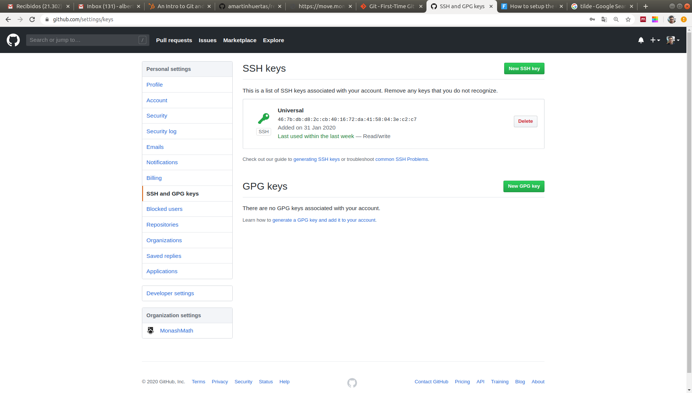<br>
Figure 1. Linking your public SSH key with your GitHub account. (Step 1)


> *__Note:__*  GitHub actively develops its user interface, so
[Figure 1](#fig_ssh_keys_1) and other GitHub screenshots shown along the section may not match the ones that you are observing in your browser exactly, but this is not a cause for concern. We expect you to be able to resolve any discrepancies on your own.


Then, you have to click on the "New SSH key" green button at the top right of [Figure 1](#fig_ssh_keys_1). You will then arrive to the screen in [Figure 2](#fig_ssh_keys_2).

<a name="fig_ssh_keys_2"></a> 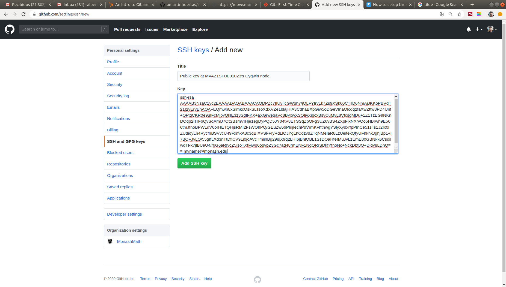<br>
Figure 2. Linking your public SSH key with your GitHub account. (Step 2)

In [Figure 2](#fig_ssh_keys_2), you have to fill two text boxes, the one labelled as "Title", and the one labelled as "Key". First, in the one labelled as "Title" you can put whatever (intention revealing) name you like to your key. In this case, we put "Public Key at MVAZ1STUL01023's Cygwin node", where `MVAZ1STUL01023` is the name of the MoVE compute node that is hosting the public key (you can retrieve it from the shell prompt or typing the `hostname` command.) Second, in the one labelled as "Key" you have to put your public SSH key, that is, the contents of the previously generated `id_rsa.pub` file. To this end, you can display on screen the contents of the file:

```bash
$ cat ~/.ssh/id_rsa.pub
ssh-rsa AAAAB3NzaC1yc2EAAAADAQABAAACAQDPZc7IIUvIlcGWgh7/jQLFYIryLk7Zs9XSk60CTllD6NmAjJKKoPBVdT21I2yEryEhAQA+EQmwb8xSlmkcOskSLTsoXdXVZe1blajHIA3CdhaBXpGiw5oDGeVInaOlcqq2faXwZttw3FD4Unf+OFtqCKR0e9uIFcMjpyQklE3z3SdIFKX+aXGrweqaVq8ByxwXSQIjvXibcxBsvCuMvL8VfcsgMDu+1Z1TzEG9NKnDOqp2lTrF6QvSqAmlJ7OtSBsmVIHje1egDyPQD5JY04tV8ETSSqZpOFg3UZ6vBS4ZXpFixNXrvOo5HBrwh9E566tmJfnoBPWLdV6orHETQHjsRMI2FsWOhPQ/GEuZw66PlirjIechPdVrmKFhthwgYSlyXydxrfpPInCe51sTs1J2Ix0lZUdioyLn4RycfhBSVvcU49FxmxA8c3qBIXVSFFIyRdLlOJYgLhCqzvdZTqNMeIaR8LzUeitexQfyUFhknkJghjBp1+i7BOFJvLQ/55gIfLXd3nTtDflCV9Lj0joAVcTmiirlBg29iqX9q2LHI6jBhlOBL1SsDOaHfeIMuJvLzEmE80GBNkk6CsdilwdTFx7jlBUeU4//6G6aRIycZ5jsoTXfFiwp6ogvpZ3Gc7ag48rmENF1NgQRrSDkfYfhoNc+NckDbt8O+Diqy8LDhQ== myname@monash.edu
```
and then copy & paste its contents from the command-line to the "Key" text box. Finally, you have to click on the "Add SSH key" button in [Figure 2](#fig_ssh_keys_2). This should reach the screen in [Figure 3](#fig_ssh_keys_3), where your key is already listed.

> *__Note:__*  In order to copy text from the Cygwin terminal into the Clipboard, you have to left-click at the beginning of the text you want to highlight and hold it pressed. While holding the left mouse button, drag the cursor to the end of the text and release the mouse button. Once completed, all text from the beginning to the end should be highlighted.
Finally, you have to Right click on the top bar of the Cygwin terminal window, and select `Edit->Copy` from the drop down list.

<a name="fig_ssh_keys_3"></a> 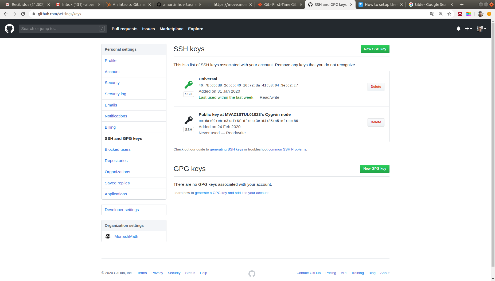<br>
Figure 3. Linking your public SSH key with your GitHub account. (Step 3)


 > *__Note:__* In general, the process so far with the SSH keys is a one-time process per computer, user on that computer, and GitHub account.
However, as already mentioned several times before, the contents of the home directory might vary among different Cygwin terminal sessions, e.g., when you close a terminal and open a new one. In the particular case of Git, the consequence of this behaviour is that the SSH keys that you have generated on the `~/.ssh/` folder in a given session might not available in a different (future) session. In such a case, you have to generate a new pair of SSH keys and link the new public SSH key with your GitHub user again. 

### 1.8.3. Creating a new GitHub project (and associated Git repository)
<a id="markdown-creating-a-new-github-project-and-associated-git-repository" name="creating-a-new-github-project-and-associated-git-repository"></a>

To create a new project in GitHub (and an associated Git repository on the Cloud), log in and go to the GitHub user's home page (if you do not find it, then just insert https://github.com/ on the browser once you are logged in). You should see a similar screen to that in [Figure 4](#fig_github_home). 


<a name="fig_github_home"></a> 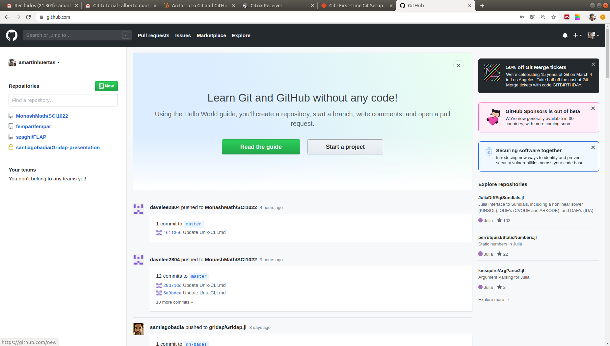<br>
Figure 4. GitHub user's home page.

Click on "Start a project". You will be redirected to the page in [Figure 5](#fig_github_new_repo). There, you have to provide a name for your GitHub Git repository (let us call it `repository4sci1022`), a Description (let us put "This is my first repository for the SCI1022 Introduction to Version Control using Git"), and finally whether we want our repository to be Public or Private. As we want to ship our project to the wide world, we will use Public in this case. Finally, we have to click on the "Create Repository" button in [Figure 5](#fig_github_new_repo).

<a name="fig_github_new_repo"></a> <br>
Figure 5. GitHub's "Create a new repository" page.

After this process, our GitHub repository has been already created. It can be accessed from a web browser using the following URL: `https://github.com/your_github_username/repository4sci1022`, where obviously you have to replace `your_github_username` by your GitHub's user name. When you visit that page, you will get an screen similar to that shown in [Figure 6](#fig_github_repo_quick_setup).

<a name="fig_github_repo_quick_setup"></a> 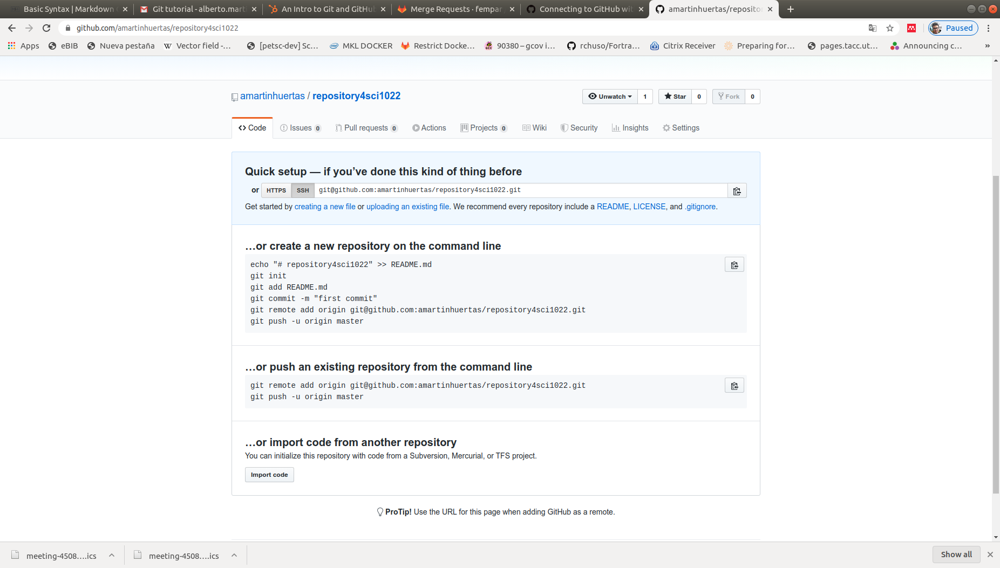<br>
Figure 6. A just created GitHub project.

Essentially the page in [Figure 6](#fig_github_new_repo) is informing us that the GitHub Git repo is void. Besides, it offers us several possibilities in order to populate it. 

### 1.8.4. Pushing into the remote Git repository at GitHub
<a id="markdown-pushing-into-the-remote-git-repository-at-github" name="pushing-into-the-remote-git-repository-at-github"></a>

We want to populate our fresh Git repository at GitHub with the contents of the **local** Git repository that we created from the Cygwin terminal in [Section 1.5](#15-creating-a-local-git-repository). In order to do so, we have to execute in the Cygwin terminal the commands shown under the *"... or push an existing repository from the command line"* header in [Figure 6](#fig_github_new_repo) . That is, we want to push our local repository up to GitHub. The exact commands will be tailored to your personal account name. In our case, the commands to be executed are:

```bash
$ git remote add origin git@github.com:amartinhuertas/repository4sci1022.git
$ git push -u origin master
Warning: Permanently added the RSA host key for IP address '13.237.44.5' to the list of known hosts.
Enumerating objects: 12, done.
Counting objects: 100% (12/12), done.
Delta compression using up to 4 threads
Compressing objects: 100% (7/7), done.
Writing objects: 100% (12/12), 1.08 KiB | 0 bytes/s, done.
Total 12 (delta 1), reused 0 (delta 0)
remote: Resolving deltas: 100% (1/1), done.
To github.com:amartinhuertas/repository4sci1022.git
 * [new branch]      master -> master
Branch 'master' set up to track remote branch 'master' from 'origin'.
```
Of course, you should replace `amartinhuertas` by your GitHub actual username. These two commands set GitHub as the **origin** remote repository of the local Git repository and then push the full (local) repository there, respectively. The **origin** is the default remote repository that one interacts with when you do not explicitly specify a remote repository in a git command. (We note that a local repository might be connected to several remote repositories.)  The `-u` option to `git push` sets GitHub as the upstream repository, which
means that we will be able to download any changes automatically when we run `git pull`. Do not worry about these details, though; you will almost always copy such commands from GitHub and probably will not ever have to figure them out on your own.

If pushing succeeded, then, after re-loading `https://github.com/your_github_username/repository4sci1022` on your web browser, you should be able to see an screen similar to that shown in [Figure 7](#fig_github_after_push).

<a name="fig_github_after_push"></a> 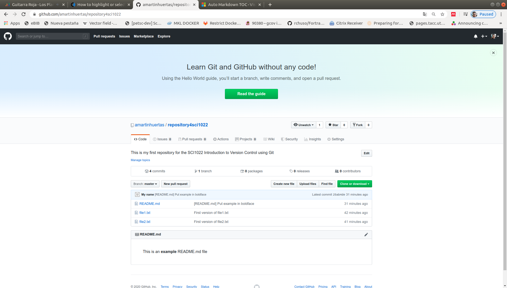<br>
Figure 7. The GitHub repository home page after pushing from the local Git repository created in the Cygwin terminal. 

----
> *__Exercise 5:__*
> * On the GitHub page for your project, click on the link labeled as “4 Commits” (see [Figure 7](#fig_github_after_push)) to see a list of your commits. Confirm that this list matches the one that you get with  `git log` executed on the Cygwin terminal.
> * At GitHub, click on the commit in which you put the word example in **bold face**. Verify that the `diff` for the commit that you get in the web browser agrees with the one that we obtained above on the Cygwin terminal with `git diff`.
----

## 1.9. Cloning a remote repository
<a id="markdown-cloning-a-remote-repository" name="cloning-a-remote-repository"></a>

The first step to start contributing to a project (e.g., [a scientific computing software package](https://github.com/nschloe/awesome-scientific-computing)) hosted on a Cloud service such as GitHub,  consists on performing an operation referred to as "cloning a remote repository". This is achieved by means of the `git clone` command. This operation **fully copies all files and folders and project history stored in a remote repository into a new directory on the local file system**. This new directory becomes itself a full repository. (Recall, from [Section 1.1](#11-version-control-in-a-nutshell), that Git is a distributed VCS.) 

One of the most useful features of Git is its ability to let us recover from errors that would otherwise be **catastrophic**. Perhaps the most serious mess that one can make is to (unintentionally) remove the local folder containing the Git repository. In our particular scenario, as we do not have local changes to be staged, changes stagged, nor commits pending to be pushed to the remote repository at GitHub, this would not lead to lost work, as we can clone the remote version of the repository from GitHub. Therefore, let us (intentionally) remove our project's local Git repository (because of obvious reasons, **please be extremely careful** to ensure that you type exactly the commands in the next box, and **not**, e.g, `rm -Rf ~/`):

```
$ cd ~/Documents/
$ rm -Rf myproject
```

If we did not have a copy of the local repository on GitHub, there would be no hope of recovering the contents of the `myproject/` folder. Fortunately, we have it, and we can clone the remote repository into the local file system as:

```bash
$ cd ~/Documents/
$ git clone git@github.com:amartinhuertas/repository4sci1022.git
Cloning into 'repository4sci1022'...
remote: Enumerating objects: 12, done.
remote: Counting objects: 100% (12/12), done.
remote: Compressing objects: 100% (6/6), done.
remote: Total 12 (delta 1), reused 12 (delta 1), pack-reused 0
Receiving objects: 100% (12/12), done.
Resolving deltas: 100% (1/1), done.
$ ls
'$RECYCLE.BIN'/   desktop.ini*   MATLAB/   repository4sci1022/
$ cd repository4sci1022/
$ cat README.md
This is an **example** README.md file
``` 

The first argument to the `git clone` is the clone URL (yours will differ, replace `amartinhuertas` by your GitHub username). The clone URL of a project in GitHub can be obtained from the home page of the project, as shown in [Figure 8](#fig_github_clone_url).  

<a name="fig_github_clone_url"></a> 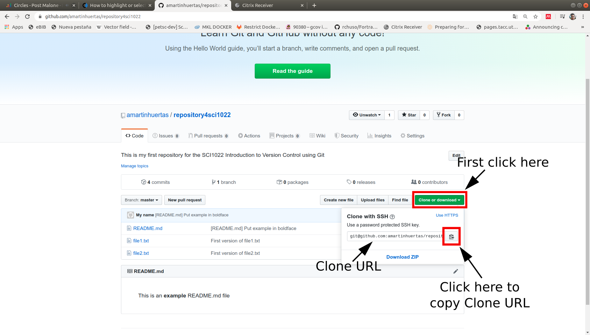<br> 
Figure 8. Obtaining the clone URL from the GitHub's repository home page. 

By default, `git clone` uses the repository name for the local folder that it creates in order to hold the repository data, i.e., `repository4sci1022` in our case. This default behaviour can be overridden if one provides a second argument to `git clone` with the name desired for the local folder to be created as part of the cloning process.

----
> *__Exercise 6:__*
> * Clone the GitHub's repository available [here](https://github.com/gridap/Gridap.jl) on a folder named `GRIDAP` at the user's home directory. *Hint*: you have to use `GRIDAP` as the second argument to `git clone`. Besides, for the first argument, you have to figure out the Clone URL of this GitHub repository.
> * Navigate over the contents of the `README.md` file of the cloned repository using `less`, and compare them with those that you can see on the  [GitHub's repository page](https://github.com/gridap/Gridap.jl).
----

## 1.10. Working alone. The commit+push cycle
<a id="markdown-working-alone-the-commitpush-cycle" name="working-alone-the-commitpush-cycle"></a>

If you are working alone in your project, it is recommended your Git workflow to be based on the commit+push cycle. Essentially, you do some local work, you commit that work (e.g., when you have reached a natural stop, or when you have made enough changes to start worrying about losing them), and then push that commit to **origin**, i.e., the (default) remote repository to which your local repository is linked with.  If you want some advice regarding to the "when to make a commit" dilemma, we recommend, e.g., [this article](https://medium.com/walmartlabs/check-out-these-5-git-tips-before-your-next-commit-c1c7a5ae34d1), although there are many other articles with best practices related to this topic that you may easily find using Google.

To illustrate the commit+push cycle, let us perform a pair of cycle iterations. In particular, let us add to the `README.md` file an image containing a portrait of [William Shakespeare](https://en.wikipedia.org/wiki/William_Shakespeare) that we will borrow from Wikipedia. To this end, we will create a new folder, , called `figures`, in the ls
local Git repository where we will store the image with the portrait.  Then, we will add a link  to that image in the `README.md` file.  We will split this work into two commits, in the first we will add the folder and the image and, in the second, we will modify the `README.md` file. After each commit, we will be invoking `git push` to send our progress to the remote repository at GitHub.  

The commands required to carry out the first iteration are (i.e., create the `figures` folder, download the image from the Internet into the new folder, add the whole folder to the staging area, commit, and push):

We note that it is not strictly necessary to follow the commit+push cycle. You can, e.g., perform 10 consecutive local commits, and then push them in one shot using a single `git push` command. However, we believe it is a good idea to get in the habit of pushing up to the remote repository frequently, as it serves as a guaranteed backup of the project while also allowing collaborators to "pull" in any
changes, as we will see in the next section.

```bash
$ cd ~/Documents/repository4sci1022
$ mkdir figures
$ curl https://upload.wikimedia.org/wikipedia/commons/thumb/a/a2/Shakespeare.jpg/220px-Shakespeare.jpg -o figures/shakespeare_portrait.jpg
  % Total    % Received % Xferd  Average Speed   Time    Time     Time  Current
                                 Dload  Upload   Total   Spent    Left  Speed
100 13577  100 13577    0     0   7492      0  0:00:01  0:00:01 --:--:--  7505
$ git add figures
$ git commit -m "Added W. Shakespeare's portrait image file"
$ git push origin
Enumerating objects: 5, done.
Counting objects: 100% (5/5), done.
Delta compression using up to 4 threads
Compressing objects: 100% (4/4), done.
Writing objects: 100% (4/4), 13.37 KiB | 15.00 KiB/s, done.
Total 4 (delta 0), reused 0 (delta 0)
To github.com:amartinhuertas/repository4sci1022.git
   25ab4de..6f9a119  master -> master
```

In the last command, we explicitly tell `git push` to push the new commit to the **origin** remote repository. However, as mentioned before, origin is the default repository one interacts with if no remote repository is specified. Thus, if we replaced the `git push origin` by `git push` in the previous box we would be achieving exactly the same result. 


> *__Exercise 7:__*
By refreshing the GitHub repository in your browser, confirm the presence of the new file by clicking on the `figures` directory link, and then on the `shakespeare_portrait.jpg` image file.

The commands required to carry out the second iteration are (i.e., edit the `README.md` file as shown below, add the changes to the index, commit, and push):

```bash
$ cd ~/Documents/repository4sci1022
$ nano README.md
$ cat README.md
This is an **example** README.md file


Figure 1. The Chandos portrait (held by the National Portrait Gallery, London)
$ git add README.md
$ git commit -m "Added Shakespeare's image to README.md"
$ git push
```

> *__Exercise 8:__*
By refreshing the GitHub repository in your browser, confirm the presence 
of Shakespeare's portrait on the home page of the project.

## 1.11. Working collaboratively
<a id="markdown-working-collaboratively" name="working-collaboratively"></a>

### 1.11.1. Branching
<a id="markdown-branching" name="branching"></a>

One of the most powerful features of Git is its ability to make **branches**, which you can think of as complete self-contained copies of the project data. With a branch you can make your changes to the project in isolation from the main version of the project, and then merge your changes in only when they are done. This is especially helpful when collaborating with other users; having a separate branch lets you make changes independently from other contributors, reducing the risk of accidental conflicts. Besides, for obvious reasons, when you collaborate in a third-party project, **it is very unlikely that you are allowed to directly push into the master version of the project**.  In the previous section we were allowed to do that only because we were project owners. 

We will use the addition of a second image to the `README.md` file as an example of how to use Git branches. Our first step is to use `git checkout` with the `-b` option, which makes a
new branch and checks it out at the same time:

```
$ git checkout -b add_shakespeare_sonnets
Switched to a new branch 'add_shakespeare_sonnets'
$ 
``` 
We have called the branch `add_shakespeare_sonnets` as we will include in the `README.md` file an image of the cover from the [1609's edition of Shake-Speares Sonnets](https://en.wikipedia.org/wiki/Shakespeare%27s_sonnets)  file.  Using the `git branch` command:

```
$ git branch
* add_shakespeare_sonnets
  master
```

we can list all branches currently defined on the **local Git repository**. The asterisk `*` indicates the currently checked-out branch. Please note that, at this point, the remote repository knows nothing about the existence of this new branch. Having checked out the branch, we are now ready to start making some changes to our working directory.

> *__Exercise 9:__* Download the image at hand from the Internet into the `figures/` folder, edit the `README.md` file to include the image downloaded in the previous step, add the new image and the changes of `README.md` to the staging area, and create a new commit.
*Hint*: the image to be added is available at the following URL: https://upload.wikimedia.org/wikipedia/commons/thumb/f/f6/Sonnets1609titlepage.jpg/220px-Sonnets1609titlepage.jpg

After this commit, the `add_shakespeare_sonnets` has diverged from `master`. The former branch contains a commit that the latter branch does not.  We finished making changes, so we are ready to merge the  `add_shakespeare_sonnets` branch back into the `master` branch. Before merging, we can see the whole set of changes performed using `git diff`. 
We saw in [Section 1.7](#17-modifying-an-already-tracked-file-viewing-the-diff) that this command can be used to see the difference between the unstaged and the staged version of a file, but the same command can be
used to show differences between branches. This particular command is of  the form `git diff branch-1 branch-2`, but if you leave the branch unspecified Git automatically reports the differences against the current branch. This means we can compare `add_shakespeare_sonnets` and `master` as follows:

```bash
$ git diff master
diff --git a/README.md b/README.md
index c88e36f..67275b2 100644
--- a/README.md
+++ b/README.md
@@ -3,3 +3,8 @@ This is an **example** README.md file
 
 
 Figure 1. The Chandos portrait (held by the National Portrait Gallery, London)
+
+
+
+
+Figure 2. Title page from 1609 edition of Shake-Speares Sonnets.
\ No newline at end of file
diff --git a/figures/shakespeare_sonnets.jpg b/figures/shakespeare_sonnets.jpg
new file mode 100644
index 0000000..5baee82
Binary files /dev/null and b/figures/shakespeare_sonnets.jpg differ
```

Where the `+` sign denotes the lines that were added to `README.md` in order to solve Exercise 9.


### 1.11.2. Push a branch to the remote repository at GitHub
<a id="markdown-push-a-branch-to-the-remote-repository-at-github" name="push-a-branch-to-the-remote-repository-at-github"></a>

Now we will push the local branch  `add_shakespeare_sonnets` to the remote GitHub repository. This allows other people to see the changes you have made. Once the branch is available at the remote repository, and **as far as the changes in it are approved by the repository owner**, the changes can then be merged into the `master` branch. To push the changes onto a new branch on GitHub, we can run the following command:

```bash
$ git push origin add_shakespeare_sonnets
Counting objects: 5, done.
Delta compression using up to 8 threads.
Compressing objects: 100% (5/5), done.
Writing objects: 100% (5/5), 24.58 KiB | 6.14 MiB/s, done.
Total 5 (delta 0), reused 0 (delta 0)
remote: 
remote: Create a pull request for 'add_shakespeare_sonnets' on GitHub by visiting:
remote:      https://github.com/amartinhuertas/repository4sci1022/pull/new/add_shakespeare_sonnets
remote: 
To github.com:amartinhuertas/repository4sci1022.git
 * [new branch]      add_shakespeare_sonnets -> add_shakespeare_sonnets
```

As a result, the branch is automatically created on the remote repository.
If you refresh the GitHub page at your browser, you will see a note saying that a branch has just been pushed into the repository. You can also click the "2 branches" link to see your branch listed there. See [Figure 8](#fig_branch_pushed).

<a name="fig_branch_pushed"></a> <br>
Figure 8. The GitHub project home page right after pushing the `add_shakespeare_sonnets` branch.


----
> *__Exercise 10:__*
> On the GitHub page for your project, click on the "Branch: master" drop-down list, and select the  `add_shakespeare_sonnets` branch. Confirm that this branch has an additional commit compared to `master`, and the presence of the cover from the 1609's edition of Shake-Speares Sonnets on the home page of the project.
----

> *__Note:__* While we are following these steps using a single GitHub account, we ask you to make the effort to think as if these steps where followed by a collaborator of us that wants to add new contents to the main page of our project or, otherwise, ourselves adding content to the `README.md` file corresponding to the project of our collaborator.


### 1.11.3. Create a Pull Request
<a id="markdown-create-a-pull-request" name="create-a-pull-request"></a>

A pull request (PR) is a way to alert the GitHub repository owner(s) that you want to make some changes to their project. It allows them to **review the changes proposed** and make sure that they look the way they should before before merging themqgiq on the `master` branch.
In order to create a PR, click on the "Compare & pull request" green button shown in [Figure 8](#fig_branch_pushed). This leads to the page shown in [Figure 9](#fig_pr_create)

<a name="fig_pr_create"></a> 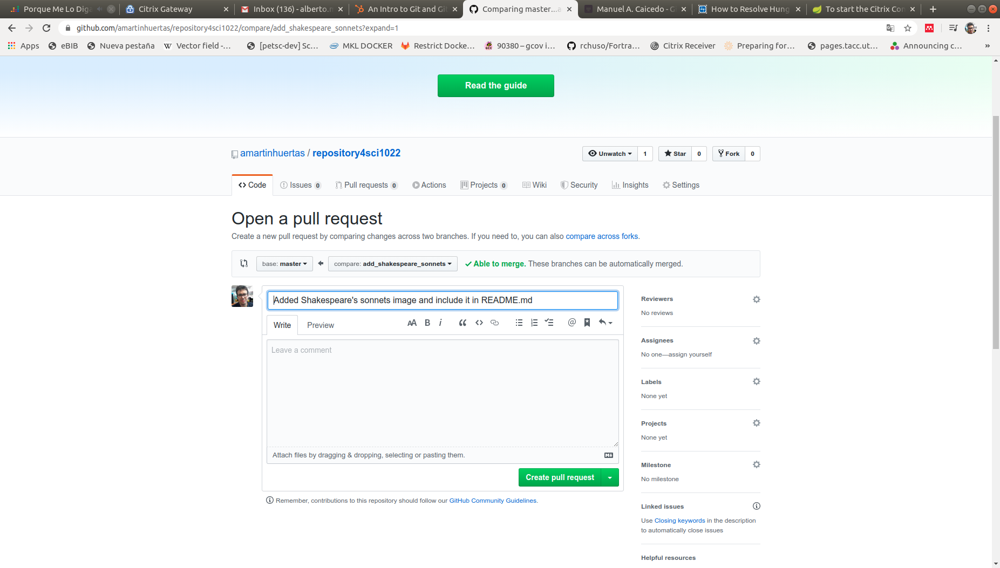<br>
Figure 9. The create PR page.

In general, it is desirable to write a thorough report of the changes to be merged. We, nevertheless, skip this step, as the title suggested by GitHub is already an accurate description of the PR. In order to create the PR, we have to click on the "Create pull request" button. This leads you to the page shown in [Figure 10](#fig_pr).

<a name="fig_pr"></a> 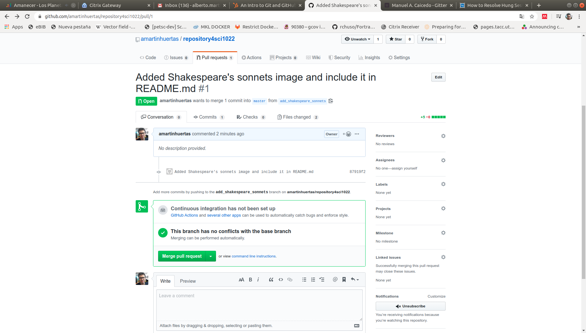<br>
Figure 10. The PR page.

You will see a big green button at the bottom that says "Merge pull request". Clicking this will merge your changes into the `master` branch. Sometimes you will be a co-owner or the sole owner of a Git repository, in which case you may not need to create a PR to merge your changes. However, it is still a best practice to make one so you can keep a more complete history of your updates and to make sure you always create a new branch when making changes.

> *__Note:__* Sometimes it is not possible to automatically merge the PR. This means you are faced with a **merge conflict**. This happens when someone has made changes in the target branch of the PR (the `master` branch in our case) that conflict with your changes. In such an scenario, Git cannot figure out automatically which version to use. Therefore, you will have to manually tell Git which version to use.
[Section 1.11.6](#1116-conflicting-changes) introduces the solution of conflicting changes.


### 1.11.4. Merge a Pull Request
<a id="markdown-merge-a-pull-request" name="merge-a-pull-request"></a>

Go ahead and click the green "Merge pull request" button. This will merge your changes into the `master` branch. When you are done, I recommend deleting your branch (too many branches can become messy), so hit the grey "Delete branch" button as well.

----
> *__Exercise 11:__*
> On the GitHub page for your project, click on the "Branch: master" drop-down list, and confirm that there is no longer a   `add_shakespeare_sonnets` branch. Check that the `master` branch now has the commit performed in the `add_shakespeare_sonnets` branch, and that the cover from the 1609's edition of Shake-Speares Sonnets is already on the home page of the project.
----


### 1.11.5. Pulling changes from the remote repository
<a id="markdown-pulling-changes-from-the-remote-repository" name="pulling-changes-from-the-remote-repository"></a>

Right now, the remote repository on GitHub looks a little different than the local one that is available on the Cygwin terminal. For example, the commit we made in  `add_shakespeare_sonnets` branch and merged into the `master` branch does not exist in the `master` branch of the local repository. Besides, the `add_shakespeare_sonnets` does no longer exist in the GitHub repository, but it does on the local one.

As the `add_shakespeare_sonnets` branch does not exist on the GitHub repository, it is reasonable that we first checkout the local `master` branch. This is achieved as follows:

```bash
$ git checkout master
Switched to branch 'master'
Your branch is up to date with 'origin/master'.
```


----
> *__Exercise 12:__*
> Use `git log` to check that the commit history for the branch `master` on the local repository does not include the latest ones that can be nevertheless seen in the GitHub page for your project.
----


In order to get the most recent changes that you or others have merged on GitHub's `master` branch, use the following `git pull` command:

```bash
$ git pull origin master
remote: Enumerating objects: 1, done.
remote: Counting objects: 100% (1/1), done.
remote: Total 1 (delta 0), reused 0 (delta 0), pack-reused 0
Unpacking objects: 100% (1/1), done.
From github.com:amartinhuertas/repository4sci1022
 * branch            master     -> FETCH_HEAD
   695b352..ef9f5c1  master     -> origin/master
Updating 695b352..ef9f5c1
Fast-forward
 README.md                       |   5 +++++
 figures/shakespeare_sonnets.jpg | Bin 0 -> 24527 bytes
 2 files changed, 5 insertions(+)
 create mode 100644 figures/shakespeare_sonnets.jpg
```

The output of the command shows all the files that have changed and how they have changed, e.g., `5 +++++` means that 5 lines were added to the file `README.md`.

----
> *__Exercise 13:__*
> Use `git log` to confirm that the commit history for the branch `master` on the local repository **now** matches the one that can be seen in the GitHub page for your project.
----

If you type `git branch`, then you will observe that the `add_shakespeare_sonnets` already exists in the local Git repository.
We can delete this local branch as well. To this end, we can execute the following command:

```bash
$ git branch -d add_shakespeare_sonnets
Deleted branch add_shakespeare_sonnets (was 87919f2).
```

----
> *__Exercise 14:__*
> Write a Git command to confirm that the `add_shakespeare_sonnets` has been deleted from the local repository. 
----


### 1.11.6. Conflicting changes
<a id="markdown-conflicting-changes" name="conflicting-changes"></a>

Even though Git merge algorithms can often automatically figure out how to combine changes from different collaborators, sometimes there is no way of avoiding a conflict. Let us illustrate the concept of conflicting changes and how to resolve them with an example. Let us assume that we are not happy with the current status of the `README.md`. In particular, we would like to change the format of the "example" word, and remove from it the boldface. To this end, we edit the `README.md` and remove the trailing and leading `**` from the word "example", and then we commit this change **but we do not push right after the commit**:

```bash
$ nano README.md
$ cat README.md 
This is an example README.md file


Figure 1. The Chandos portrait (held by the National Portrait Gallery, London)


Figure 2. Title page from 1609 edition of Shake-Speares Sonnets.
```
```
$ git add README.md
$ git commit -m "The word example no longer in boldface at README.md"
[master 183ac79] The word example no longer in boldface at README.md
 1 file changed, 2 insertions(+), 2 deletions(-)
```

In the meantime, a collaborator of yours that **is not project owner**, is not happy either with the "example" word in boldface. He prefers it to be in italics. As he is not project owner, he is forced to propose the change the PR way. 

----
> *__Exercise 15:__*
> Mimic the workflow that your collaborator will follow in order to propose the aforementioned change via a PR. This workflow is composed of the following 5 steps:
>
> 1. Clone the GitHub repository in a different folder, e.g., in `repository4sci1022_collaborator`
> 2. Create a local branch in your collaborator's copy of the GitHub repository, named, say, `set_example_in_italics_at_readme_file`.
> 3. Edit the `README.md` file using `nano`, and replace "\*\*example\*\*" by "\*example\*", i.e., boldface by italics.
> 4. Add changes to the staging area and create a new commit into the  `set_example_in_italics_at_readme_file` branch.
> 5. Push the branch to the remote repository at GitHub, create a PR from `set_example_in_italics_at_readme_file` to `master` at GitHub, and merge this PR at GitHub.
>
> Before executing step 5, can you advance whether there will be *merge conflict* in this scenario? Why? Why not? *Hint*: at the beginning of the section, we performed local changes and registered them into a new local commit, but **we did not actually push into `master`**.
----

Now move to the original local copy of the remote GitHub repository (we will no longer play the role of your collaborator). If you completed successfully the steps in Exercise 15, you should obverse the following after pulling the latest changes into `master` from the remote repository:

```
$ git pull origin master
remote: Enumerating objects: 5, done.
remote: Counting objects: 100% (5/5), done.
remote: Compressing objects: 100% (3/3), done.
remote: Total 3 (delta 1), reused 0 (delta 0), pack-reused 0
Unpacking objects: 100% (3/3), done.
From github.com:amartinhuertas/repository4sci1022
 * branch            master     -> FETCH_HEAD
   ef9f5c1..cebc330  master     -> origin/master
Auto-merging README.md
CONFLICT (content): Merge conflict in README.md
Automatic merge failed; fix conflicts and then commit the result.
```

As indicated in the penultimate line, Git has detected a merge conflict after the pull. The set of files with merge conflicts still to be resolved can be printed on screen using `git status`. We can see the effect of this conflict by viewing the file `README.md` in `nano`, as shown in [Figure 11](#fig_nano_conflict). 

<a name="fig_nano_conflict"></a> 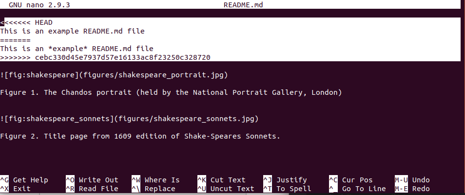<br>
Figure 11. A file with a merge conflict highlighted.

The highlighted text in [Figure 11](#fig_nano_conflict) states that there are two conflicting versions of the first line of `README.md`. In the first, i.e., `HEAD` (our local version), the "example" word appears with no special format. In the second, i.e., the one corresponding to our collaborator's commit with hash `cebc330 ...` ,  the "example" word appears in italics. We prefer the word with no format, so that we manually solve the conflict by editing the `README.md` file, with the result shown in [Figure 12](#fig_nano_conflict_solved). 

<a name="fig_nano_conflict_solved"></a> 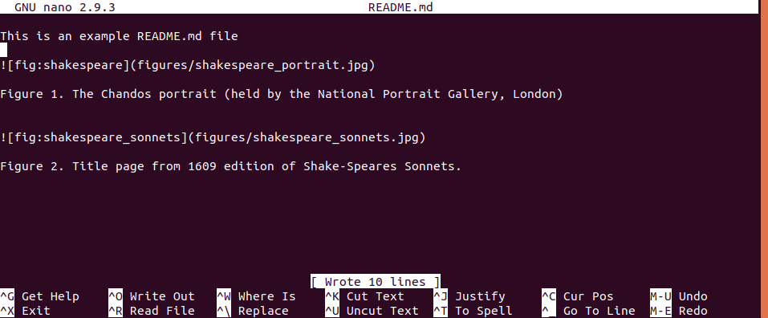<br>
Figure 11. The file `README.md` with the merge conflict solved.

After saving the file, we can commit the file with the conflict resolved, and, at this point, we are ready to push in to `master` (check it!).
The local `master` branch in the local copy of the repository of our collaborator does not actually reflect this change. Therefore, the last step in our collaborator's workflow would be a `git pull origin master` command. 


----
> *__Final exercise:__*
> Create a PR in the GitHub repository available at the following URL: https://github.com/amartinhuertas/SCI1022_git_final_exercise. The PR should include a single commit with a version of the `README.md` file containing a link to the GitHub repository you have created along the session. The line to add should be of the form: "Given Name(s) Family name GitHub repository is available [here](URL of your repo goes here)". This link will allow us evaluate your progress with the tutorial.
----

## 1.12. Conclusions and further references
<a id="markdown-conclusions-references" name="conclusions-references"></a>

After completing this workshop, we expect you, at the very least, to be able to understand **why Git has to become an absolute must-use tool in your daily workflow**. Indeed, we highly encourage that you use Git to track the code that you will develop during the rest of modules in this subject, and more importantly, along your whole career. There is a lot more to learn. For example, we did not cover most of **error-recovery** techniques of Git. One of the most useful features of Git is its ability to let us recover from errors that would otherwise be catastrophic.
You can learn more about this topic [here](https://medium.com/@i_AnkurBiswas/common-git-mistakes-and-how-to-fix-them-10184cd5fa77) and [here](https://www.git-tower.com/blog/surviving-with-git-videos/).
If you continue down this technical path you will keep getting better at using Git for years to come.

We recommend seeking out additional resources. The Internet is plenty of excellent resources related to Git that you can use in order to expand your current skills. Here are some suggestions:

* [Learn enough Git to be dangerous](https://www.learnenough.com/git-tutorial/getting_started) tutorial by [Michael Hart](https://www.michaelhartl.com/)
* [Version Control with Git](https://swcarpentry.github.io/shell-novice/) workshop by [Software Carpentry](https://software-carpentry.org/lessons/index.html)
* Free [Pro Git book](https://git-scm.com/book/en/v2) by Scott Chacon and Ben Straub 
* [Git tutorials](https://www.atlassian.com/git/tutorials) by Atlassian  ([BitBucket](https://bitbucket.org/) developers)
* [Tower Git tutorials](https://www.git-tower.com/learn/)
