<a rel="license" href="http://creativecommons.org/licenses/by-nc-sa/4.0/"></a><br />This work is licensed under a <a rel="license" href="http://creativecommons.org/licenses/by-nc-sa/4.0/">Creative Commons Attribution-NonCommercial-ShareAlike 4.0 International License</a>.

<!-- TOC -->

- [1. Introduction to the Unix command-line (5h)](#1-introduction-to-the-unix-command-line-5h)
    - [1.1. The basics](#11-the-basics)
        - [1.1.1. Unix and its command-line](#111-unix-and-its-command-line)
        - [1.1.2. Running a terminal](#112-running-a-terminal)
        - [1.1.3. Typing our first commands. Looking for help using `man`](#113-typing-our-first-commands-looking-for-help-using-man)
        - [1.1.4. Editing the current line](#114-editing-the-current-line)
        - [1.1.5. Clearing screen](#115-clearing-screen)
        - [1.1.6. The Unix file system](#116-the-unix-file-system)
    - [1.2. Files](#12-files)
        - [1.2.1. Output redirection and appending](#121-output-redirection-and-appending)
        - [1.2.2. Input redirection](#122-input-redirection)
        - [1.2.3. Listing files: the `ls` command](#123-listing-files-the-ls-command)
        - [1.2.4. "Hidden" files](#124-hidden-files)
        - [1.2.5. "Touching" files](#125-touching-files)
        - [1.2.6. Copying, renaming, and deleting files](#126-copying-renaming-and-deleting-files)
    - [1.3. Directories](#13-directories)
        - [1.3.1. Directory structure](#131-directory-structure)
        - [1.3.2. Creating directories](#132-creating-directories)
        - [1.3.3. Navigating over the file system](#133-navigating-over-the-file-system)
        - [1.3.4. Copying, renaming, and deleting folders](#134-copying-renaming-and-deleting-folders)
    - [1.4. File and directory permissions](#14-file-and-directory-permissions)
        - [1.4.1. Users and groups](#141-users-and-groups)
        - [1.4.2. Permissions](#142-permissions)
    - [1.5. Advanced file inspection](#15-advanced-file-inspection)
        - [1.5.1. Downloading files](#151-downloading-files)
        - [1.5.2. `head` and `tail`](#152-head-and-tail)
        - [1.5.3. Counting words and the concept of command pipelining](#153-counting-words-and-the-concept-of-command-pipelining)
        - [1.5.4. Paging output with `less`](#154-paging-output-with-less)
        - [1.5.5. Text searching with `grep`](#155-text-searching-with-grep)
    - [1.6. Tab completion and command history](#16-tab-completion-and-command-history)
    - [1.7. Brief introduction to the GNU `nano` command-line text editor](#17-brief-introduction-to-the-gnu-nano-command-line-text-editor)
    - [1.8. Conclusions and further references](#18-conclusions-and-further-references)

<!-- /TOC -->


# 1. Introduction to the [Unix](https://en.wikipedia.org/wiki/Unix) command-line (5h)
<a id="markdown-introduction-to-the-unix-command-line-5h" name="introduction-to-the-unix-command-line-5h"></a>

This tutorial provides an introduction to the [Unix](https://en.wikipedia.org/wiki/Unix) command-line. The workshop can be considered as a first step for those who are interested in learning the Unix way of using and developing scientific software, i.e., those who will use scientific software packages and/or collaborate with scientific software developers, and those who aspire to become developers themselves. The tutorial is designed for complete beginners. All you need is a minimum of general computer fluency, i.e., how to execute an application, to surf the web (using, e.g., [Chrome](https://www.google.com.au/chrome/), or any other web browser), [touch typing](https://en.wikipedia.org/wiki/Touch_typing), etc. In fact, the tutorial does not even assume that you know what [Unix](https://en.wikipedia.org/wiki/Unix) or the [command-line](https://en.wikipedia.org/wiki/Command-line_interface) are, so if you find yourself struggling with the title, no problem, you are in the right place.
Finally, if you have ever used the Unix command-line, or even if you have familiarity with it to some extent, following the tutorial will reinforce your current understanding, and hopefully expand your knowledge a little bit further.

## 1.1. The basics
<a id="markdown-the-basics" name="the-basics"></a>

### 1.1.1. Unix and its command-line
<a id="markdown-unix-and-its-command-line" name="unix-and-its-command-line"></a>

The term **Unix** is used to refer to a family of different (but related) Operating System (OS) software. An OS is a cornerstone layer of software between the user (actually between programs executed by the user) and the computer hardware that simplifies computer usage by hiding its extremely complex underlying organization. It manages files, screen output, keyboard input, and makes sure that multiple users and their programs can coexist without clashes in a single system, among other things.
There are primary two base versions of UNIX around: System V and Berkeley Software Distribution (BSD).
Apple has Darwin which is close to BSD. IBM and HP have their own versions of Unix based on System V, namely HP-UX and AIX, respectively.  Linux is an [*open source software*](https://opensource.com/resources/what-open-source), variant of UNIX, meaning it is free to use and modify. Within Linux, there are in turn several Linux distributions such as [Red Hat](https://www.redhat.com/en/topics/linux) or [Ubuntu Linux](https://ubuntu.com/). Most of this tutorial will most probably work on any Unix-like system. The [differences](https://opensource.com/article/18/5/differences-between-linux-and-unix) among these are subtle, and following this tutorial in different systems should not make such a big difference.

Today, most OSs come with a Graphical User Interface (GUI). Microsoft Windows, Apple macOS, or even Linux have one. While a GUI dramatically simplifies computer usage, we note that in the beginning of computer history there were no GUIs around; the only way for the user to interact with the computer was through a **Command-Line Interface** (CLI). In such an interface, the user types *commands* that tell the computer what to do.
These commands can be combined in a wide range of different ways to achieve different outcomes. A special program, referred to as *the shell*, is in charge of continuously reading and executing the commands interactively typed by the user in a [Read-Eval-Print Loop (REPL)](https://en.wikipedia.org/wiki/Read%E2%80%93eval%E2%80%93print_loop). Most of the time you are using a Unix-like system, you are typing commands on a CLI.
An example of such a command is provided in [Figure 1](#fig_command_example).

<a name="fig_command_example"></a> 
Figure 1. An example of a Unix command-line command.

While Unix-type OSs are not ubiquitous in desktop or laptop computers, they however dominate the landscape of scientific computing. As an example,  [Linux runs on all](https://itsfoss.com/linux-runs-top-supercomputers/) of the [Top500 List](https://www.top500.org/) computers (a rank of the most powerful supercomputers all over the world), as per the report of June, 2019. The figures are similar for lower scale computing systems (e.g., a University, department or research group computing platform). Whether you like it or not, it is very likely that you will have to face a Unix CLI at some point if you want to do serious scientific computations. Indeed, if you look at the desktop of an experienced scientific developer, even in a Unix-type OS equipped with a GUI, such as Ubuntu Linux, you are likely to find a large number of "terminal" windows, each running an instance of the shell.

<a name="fig_typical_desktop_experienced_user"></a>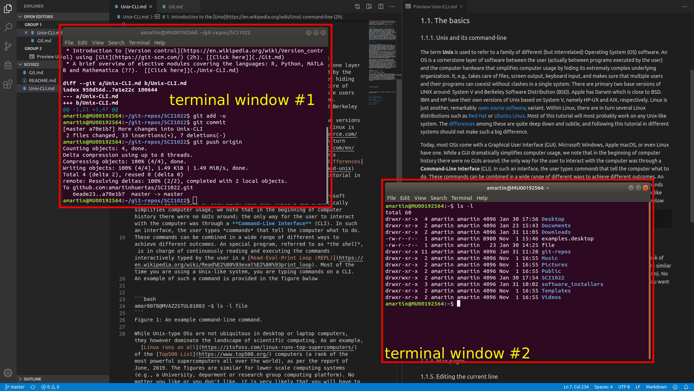
Figure 2. A typical desktop of an experienced scientific software developer with two terminal windows on Ubuntu Linux.

There are a few Unix shells available. Many commands are common to the various shells available, but some of their syntax may still differ to a large extent. In this workshop we will assume that you are using the (most commonly used) [`bash`](https://en.wikipedia.org/wiki/Bash_(Unix_shell)) shell. Other possible shells include the [*ksh*](https://en.wikipedia.org/wiki/KornShell), [*zsh*](https://en.wikipedia.org/wiki/Z_shell), [*csh*](https://en.wikipedia.org/wiki/C_shell), or [*tcsh*](https://en.wikipedia.org/wiki/Tcsh) shells.

### 1.1.2. Running a terminal
<a id="markdown-running-a-terminal" name="running-a-terminal"></a>

In order to run command-line commands, we first need to execute a **_terminal_**. A terminal is a program that gives us a command line by executing an instance of the shell; see, e.g., [Figure 2](#fig_typical_desktop_experienced_user). The way in which a terminal is opened depends on the particular Unix-type OS at hand. For example, on macOS, a terminal window can be found by typing "terminal" in the [Spotlight Search bar](https://support.apple.com/en-us/HT204014),
while in Ubuntu Linux, you can click on the terminal icon at the Ubuntu Dock, i.e., the bar on the left-hand side of the screen which is used to pin and access installed applications; see [Figure 3](#fig_ubuntu_linux_dock).

<a name="fig_ubuntu_linux_dock"></a>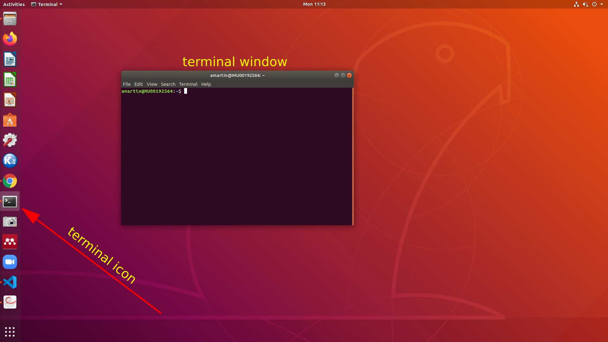
Figure 3. The terminal icon in Ubuntu's Linux Dock.

In this tutorial, however, we assume that you are working on your own desktop, laptop, or tablet, and **_that you do not necessarily have an installed working version of a Unix-type OS_** such as, e.g., macOS or Ubuntu Linux. To bypass the need for specialized software installed on your device, we will use the [Monash Virtual Environment (MoVE)](https://www.monash.edu/learning-teaching/innovation/educational-technologies/move) platform instead in order to run a terminal.

> *__Note:__* At this point, we strongly encourage you to carefully read the [MoVE users' guide](https://www.monash.edu/__data/assets/pdf_file/0003/1480665/MoVE-student-and-staff-access-guide-2019.pdf) if it is your first experience with MoVE and/or you find any trouble while following the proceeding steps. We recommend that you configure your device in order to run the [full version](https://www.monash.edu/__data/assets/pdf_file/0003/1480665/MoVE-student-and-staff-access-guide-2019.pdf) of MoVE as it generally provides an smoother experience than the [light](https://www.monash.edu/__data/assets/pdf_file/0003/1480665/MoVE-student-and-staff-access-guide-2019.pdf) version. In any case, the tutorial may be followed as well with the light version.

In order to open a terminal within this environment you have to:

1. [Access MoVE](https://move.monash.edu/) using your Monash account details to log in. 
2. Click on the Cygwin APP by clicking on the icon depicted in [Figure 4](#fig_cygwin_icon).  This should download a Citrix client file (e.g., `TW92ZVByb2RDb250cm9sbGVycy5DeWd3aW4-.ica`).
3. Run the file downloaded in Step 2. by clicking on it. 


<a name="fig_cygwin_icon"></a> 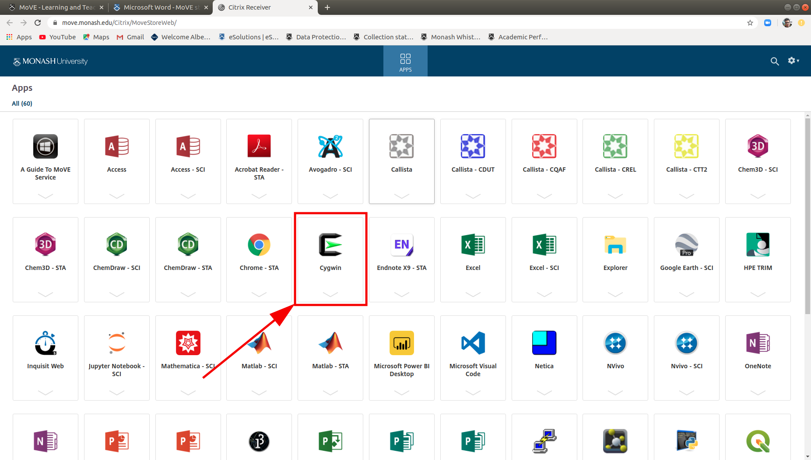
Figure 4. The Cygwin APP icon pointed by a red arrow.

If these steps succeed, then a new stand-alone window (or a new web browser tab if you are using the [light version](https://www.monash.edu/__data/assets/pdf_file/0003/1480665/MoVE-student-and-staff-access-guide-2019.pdf) of MoVE) containing a Cygwin terminal should be opened. This newly created window should look similar to the one depicted in [Figure 5](#fig_cygwin_terminal).

<a name="fig_cygwin_terminal"></a> 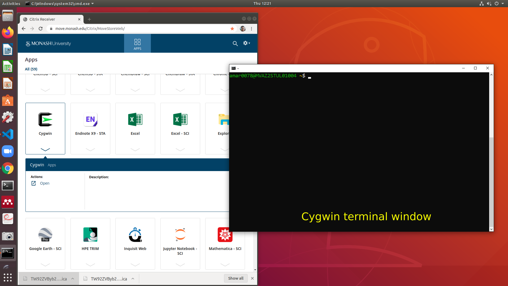
Figure 5. Cygwin terminal window.

> *__Note:__*  At this point, you might be wondering what [Cygwin](https://www.cygwin.com/) is.  In a nutshell, Cygwin is a software that provides similar functionality to that of a Linux distribution on Microsoft Windows. It is **not** a full-blown Unix-type OS. While Cygwin is a tool that will let us introduce you to the Unix command-line, and its perfectly fine for that purpose, for a number of reasons that are not that easy to understand at this stage, we would not recommend it as the most appropriate environment for users and developers of scientific software, but a full-blown Linux distribution or macOS instead. As an alternative to Cygwin, Windows users may still avoid installing a Linux distribution on their device by running a *virtual machine* (a simulator of a computer); [VirtualBox](https://www.virtualbox.org/) is a free software that is perfect for [such purposes](https://www.virtualbox.org/attachment/wiki/Screenshots/Ubuntu_14.04_on_Windows_7.png). In any case, we won't explore this possibility in this tutorial, nor require from you to be able to set up a virtual machine on your Windows device. 

The example in [Figure 1](#fig_command_example) includes all the components of a typical command-line, as dissected in [Figure 6](#fig_cygwin_terminal). Every command-line usually starts with some symbols that prompt us for "action", i.e., that encourage us to type a new command. These symbols are referred to as the **_prompt_**. The prompt is followed by a **command** and, *in this particular example*, a single **_option_** (also known as flag), and a single **_argument_**. Depending on the command, it may require one or more flags or arguments, or even none at all. We will explore a variety of different commands later in this section. Finally, we have the cursor that marks the position of the next character to be introduced. 

<a name="fig_components_command_line"></a> 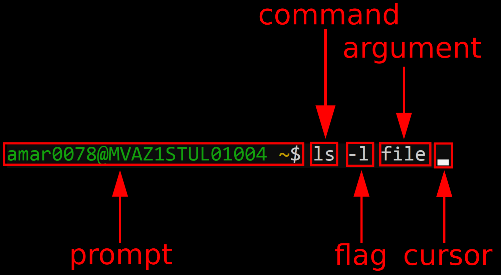
Figure 6. The command-line in [Figure 1](#fig_command_example) dissected into its different components.

> *__Note:__* The prompt typically ends with the `$` sign, and may be preceded by information that depends on the details of the system you are using. For example, in [Figure 6](#fig_components_command_line), the prompt is composed by the concatenation of the following strings: (1) the name of the user: `amar0078`; (2) the `@` sign; (3) the name of the machine: `MVAZ1STUL01004`; (5) a space character; and (6) the directory of the file system in which one is currently located; the `~` symbol is just an alias for the home directory of the user. This latter concept (i.e., user home directory) will be introduced later in [Section 1.3.1](#131-directory-structure).

------
> *__Exercise 1:__* Taking as a reference [Figure 6](#fig_components_command_line), identify the *prompt*, *command*, *flag* (if any), *argument* (if any), and *cursor* of the command-line commands shown in [Figure 7](#fig_exercise_prompt). *Hint:* the cursor is only shown on the current line, i.e., the line in which we are about to introduce the next command of the terminal session. 
------

<a name="fig_exercise_prompt"></a> 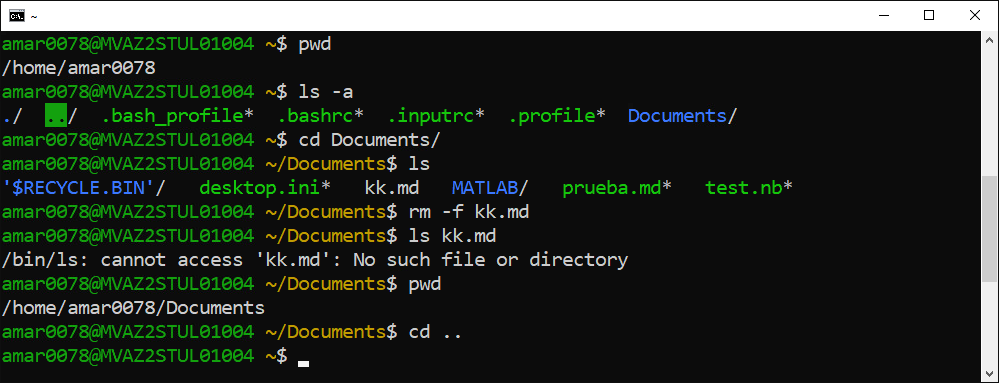
Figure 7. A series of Unix command-line commands. 

### 1.1.3. Typing our first commands. Looking for help using `man`
<a id="markdown-typing-our-first-commands-looking-for-help-using-man" name="typing-our-first-commands-looking-for-help-using-man"></a>

We are now ready to run our first command, in particular, one that simply prints a message (a message is nothing but a sequence of characters, also known as string of characters, or simply *string*) on screen. The place where this message is printed is called "standard output". By default, commands are set up such that the standard output is connected to the user's screen, but it is possible to modify such default behaviour in order to redirect messages, e.g., to an output file or even a printer. The name of the command in charge of printing messages to standard output is `echo`, and it gets as an argument the message that you want to print. For example, if you want to print the message "hi!", just type "echo hi!" at the prompt (without the leading and trailing double quotation marks) and press the Return key of the keyboard (also referred as to Enter key):

```bash
$ echo hi!
hi!
$
```

You can observe that, as expected, `echo hi!` prints the message "hi!" on screen, and then gives us the control again by returning a prompt. From now own, in the seek of conciseness, we will assume that the prompt is just the `$` character.

The argument of the `echo` command can be wrapped around single or double quotation marks, with the output being equivalent as without quotation marks:

```bash
$ echo byebye
byebye
$ echo "byebye"     #message within double quotation marks   
byebye
$ echo 'byebye'     #message within single quotation marks
byebye
```

However, if the string to be printed has spaces in it, putting or not putting quotation marks makes a high difference:

```bash
$ echo bye    bye
bye bye
$ echo "bye    bye"
bye    bye
```

In the first case, we are actually passing two arguments to `echo`, i.e., the string "bye" as first and second arguments. If more than one argument is present, then `echo` concatenates all the arguments in a single string, separating them by spaces. This justifies why `echo bye    bye` results in the string "bye bye" printed to screen. 
In the second case, we are passing just a single argument, i.e., the string "bye&nbsp; &nbsp; &nbsp; &nbsp; bye" with a bunch of spaces in the middle, which are thus printed on screen. This behaviour applies not only to `echo` but all of the Unix command-line commands.

A frequently undesired effect arises when one uses quotation marks and presses the Return key without closing the quotation mark:

```bash
$ echo 'bye bye
> 
```
At this point, we seem to be stuck. Although in this particular situation there is a way to solve the dilemma (indeed, the solution is as simple as typing the closing quotation mark and then pressing the Return key; please note that in such a case the end of line character is part of the string to be printed as well), it is very convenient that you familiarize as soon as possible with a technique that lets you abort a command if you get into trouble. This strategy is called "`Ctrl-C`", which stands for "**While holding pressed** the `Ctrl` keyboard key, press the keyboard key labelled `C`".  Please note that `C` does not actually refer to capital letter C, but to the key labelled `C`, so that you should not press the key labelled as `Shift` in between `Ctrl` and `C` keys. There are a number of commands that can prevent or hinder entering further commands, such as, e.g., those listed in [Figure 8](#fig_list_commands).


```bash 
$ echo "hi!
```
```bash
$ sleep 5000 
```
```bash
$ yes
```
```bash
$ head
```
```bash
$ cat
```
<a name="fig_list_commands"></a>Figure 8: A list of Unix commands that impede you from typing further commands.


In all cases, the solution is the same: to hit "`Ctrl-C`". If this technique still fails, then in many cases pressing the key labelled as `ESC` (escape) can get you out of trouble.


------
> *__Exercise 2:__* Run the commands in [Figure 8](#fig_list_commands), one after the other, and confirm that you can cancel them and get out of trouble by hitting "`Ctrl-C`".
------

The shell includes a very useful (yet rather cryptic) command to get comprehensive help about other commands. The name of this command is `man` (abbreviation for "manual"). It takes as an argument the name of the command we want help about. For example, the result of running `man echo` is shown in [Figure 9](#fig_echo_command_output).


<a name="fig_echo_command_output"></a> 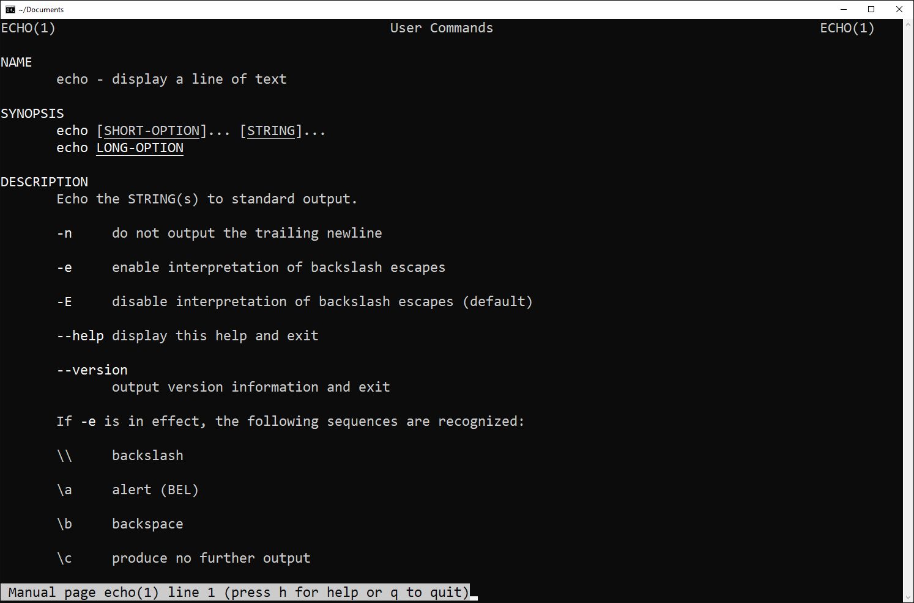
Figure 9. The output of `man echo` as displayed in the Cygwin terminal.

The output of `man` is such that you can go through it using, e.g., the down arrow key or the space key. These let you access to the rest of the manual one line  and one page at a time, respectively. The current line of the manual in which we are positioned is indicated in the message at the bottom of [Figure 9](#fig_echo_command_output), along with other useful information. As stated by this message, pressing the key labeled as `Q` in the keyboard lets you exit from the manual page, while pressing the one labeled as `H`, you go to a help page with all navigation options explained. The navigation of man pages is actually managed under the hood by another command, named `less`, that we later explore in [Section 1.5.4](#154-paging-output-with-less).

`man` itself is a command. Then, it makes sense to invoke `man man`. The manual page of the `man` command is illustrated in [Figure 10](#fig_man_command_output). There you may check that things get much more complicated. For example, anyone in its own right would say that the synopsis of `man` is quite cryptic:

```man  [-C  file] [-d] [-D] [--warnings[=warnings]] [-R encoding] [-L locale] [-m system[,...]] ... ```

Indeed, in many cases, and in particular as a beginner, you may find man pages very difficult to understand, if not impossible sometimes. However, being able to navigate a man page, and understand the most of it is a very valuable skill that pays off acquiring. To improve this skill, we recommend that you go over the manual page of each new command that you want to explore even if the details are not entirely grasped. 

<a name="fig_man_command_output"></a> 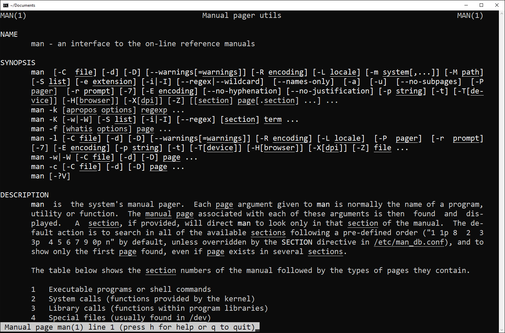
Figure 10. The output of `man man` as displayed in the Cygwin terminal.

------
> *__Exercise 3:__* Go over the man page of the `echo` command, and identify the option that lets you avoid printing the newline character at the end of the string received as the argument to `echo`. Print the "hello, world" message, with and without the option.  Is the difference among these two as expected? Note that the position of the option matters, as stated in the `echo` manual page and shown in [Figure 6](#fig_components_command_line). What happens if you put the option at the end? Why?
------

### 1.1.4. Editing the current line
<a id="markdown-editing-the-current-line" name="editing-the-current-line"></a>

The shell (recall that we are using the `bash` shell) provides several features that let you become more productive in command-line typing. These include repeating previously introduced commands, basic editing and quick navigation over the current command-line. Hitting the up arrow key, i.e., the one labeled as &#8593;, one can retrieve the previously introduced command. Pressing it multiple times, we can navigate upwards the history of commands introduced so far. On the other hand, with the down arrow key &#8595;, we navigate the history the other way round towards the latest introduced command. 

The control key, usually written as `Ctrl` or `^` (this is the notation that we will use hereafter to refer to it), is the first key to be hit in order to access to a bunch of navigation and editing options. For example, when we are typing a command, or dealing with a previously typed one, it is very useful to be able to navigate across the line, i.e., to move the cursor to the desired position. Assume that we typed

```bash
$ byebye
```

but we forgot to type the `echo` command before the message to be printed. One can of course hit the left arrow key &#8592; repeated times until the cursor is positioned at the beginning of the line, input the missing command, and then the right arrow key &rarr; repeated times towards continuing editing the line.  While this is not such a big deal in this particular case, imagine that you had already typed, e.g., a 100 characters long message. It is quickest to hit `^A` (i.e., `Ctrl-A`), that moves the cursor to the beginning of the line **in one shot**. Similarly, `^E` positions the cursor at the end of the line. Finally, the `^U` key combination removes all characters from the beginning of the command-line to the current position of the cursor.

------
> *__Exercise 4:__* Use the up arrow in order to print the messages “cold”, “cord”, “word”,  “ward”, "hard" without retyping `echo` each time.

> *__Exercise 5:__* Go over the man page of the `bash` command (i.e., the shell), and identify the section of the manual where the keyboard key combinations for navigation across the command-line are presented. In order to do so, after executing `man bash`, you can type `/`, followed by the string "Commands for Moving" string (without double quotation marks), and finally press the Return key. This should let you quickly move to the section of the manual which we are interested in (the forward slash character `/` is indeed the feature that lets you search a particular string within a man page). In this section, identify the two key combinations that let you move forward and backward a whole word at a time through the command line. Hint: in the man page, `M-` stands for hold pressed the key labelled as `Alt` while hitting the following key. Type four words separated by spaces on the command line, e.g., "word1 word2 word3 word4" and play around with these key combinations, and the `^A`, `^E`, and `^U` covered above.
------


### 1.1.5. Clearing screen
<a id="markdown-clearing-screen" name="clearing-screen"></a>

The `clear` command can be used in order   to clean up the output so far up to the bottom of the window by clearing the terminal screen. This can be useful, e.g., if you have been experimenting with a command, with a number of error messages in the path towards understanding it, and you then want to give it a clean new try. A key combination with the same result as `clear` is `⌃L`. 

On the other hand, when we are done with a terminal window and you feel ready to end the current session, you can use the `exit` command or the `⌃D` key combination.

------
> *__Exercise 6:__* Open a new Cygwin terminal, write some commands in it, then clear the screen, and exit from the terminal.
------

### 1.1.6. The Unix file system
<a id="markdown-the-unix-file-system" name="the-unix-file-system"></a>

Along the tutorial we will learn basic commands for manipulating **files** (create, display, edit, remove, etc.) and **directories** (create, list, rename, navigate, etc.). Files and directories are the basic building blocks of the **Unix file system**. The Unix file system is a recursive tree-like structure rooted at the so-called root directory, which is referred to by the forward slash character `/`. The root directory is in turn composed by files (which are terminal/leaf nodes of the tree) and directories. Each directory is in turn the root of a subtree of the whole file system. See [Figure 11](#fig_unix_file_system). In contrast to Windows OSs, where one has different units, such as, e.g., unit `C:\`, `D:\`, etc., each with its own recursive directory tree, in any Unix OS there is **always a single** directory tree. This does not mean that one cannot have in a Unix system multiple storage devices (e.g., an USB stick or an external USB hard disk) connected to the system. In Unix, the file system rooted at these storage devices becomes a subtree of the whole file system. The directory of the whole file system which is mapped  to the root of the file system of the storage device is referred to as the **mount point** of the device, and we say that the device is **mounted** on that directory.

<a name="fig_unix_file_system"></a> 
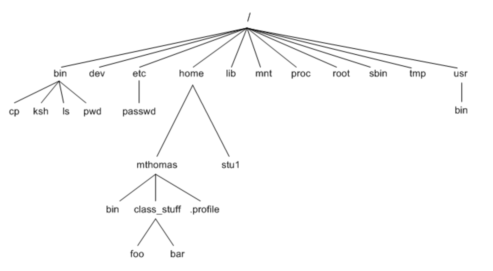<br>
Figure 11. Illustration of the Unix file system. Terminal nodes (also known as leaves) are either files (e.g., `cp`, `ksh`, or `passwd`) or directories (e.g., `lib`). Terminal directories are void directories, i.e., directories without files and (sub)directories. Later on we will learn commands that will let us distinguish whether, e.g., a given item of the file system is actually a file or a directory, or to check whether a directory is empty or not.

> *__Note:__* the `tree` command outputs on screen the directory tree which is  rooted at the current directory. Run the command to check it. If you do not understand the output by now, no problem, you will definitely at the end of this tutorial.

## 1.2. Files
<a id="markdown-files" name="files"></a>

In this section, we will work at several places with the text in [Figure 12](#fig_random_text), composed of several separated sentences. Don't try to make much sense of it, it was generated with [a random text generator](http://randomtextgenerator.com/).

```
Arrived compass prepare an on as.
Reasonable particular on my it in sympathize.
Size now easy eat hand how.
Unwilling he departure elsewhere dejection at.
Heart large seems may purse means few blind.
Exquisite newspaper attending on certainty oh suspicion of.
He less do quit evil is.
Add matter family active mutual put wishes happen.
She suspicion dejection saw instantly.
Well deny may real one told yet saw hard dear.
Bed chief house rapid right the.
Set noisy one state tears which. No girl oh part must fact high my he.
Simplicity in excellence melancholy as remarkably discovered.
Own partiality motionless was old excellence she inquietude contrasted.
```
<a name="fig_random_text"></a> 
Figure 12. Random text that we will use for some of the examples and exercises in this section. 

### 1.2.1. Output redirection and appending
<a id="markdown-output-redirection-and-appending" name="output-redirection-and-appending"></a>

One of the simplest ways of creating a new file is by using a feature of the shell known as output redirection. Recall from [Section 1.1.3](#113-typing-our-first-commands-looking-for-help-using-man) that the place where messages are  printed is called "standard output". Redirection is a feature of the shell that lets one connect the standard output of a command with an output file. The shell uses the symbol `>` (greater than) to denote output redirection. The symbol generally appears at the end of the command, followed by the name of the file we want to connect the standard output to. Let us assume that we want to create a new text file with the first sentence in [Figure 12](#fig_random_text). We can do this by typing the following command:

```bash
$ echo "Arrived compass prepare an on as." > sentences.txt
```
A new file of name `sentences.txt` is created on the current directory if it did not already exist; otherwise it is **overwritten**. 

> *__Note:__* You can avoid typing the sentence yourself by copying it from the web browser, and then pasting it into the Cygwin terminal. In order to do so, once you have copied the sentence, you have to Right click on the top bar of the Cygwin terminal window, and select `Edit->Paste` from the drop down list. In any case, we strongly encourage you to avoid copy & paste as a general rule, but to type the commands yourself to facilitate that they are burned in your mind as soon as possible. 

> *__Note:__* If you are using the light version of MoVE, copy & paste is a bit more involved. See [MoVE users' manual](https://www.monash.edu/__data/assets/pdf_file/0003/1480665/MoVE-student-and-staff-access-guide-2019.pdf) for more details.  

We can inspect the contents of the new file using the `cat` command as follows:
```bash
$ cat sentences.txt
Arrived compass prepare an on as.
```
Although `cat` is not (by far) the most suitable way for inspecting the content of a file (we will cover more advanced ones in [Section 1.5](#15-advanced-file-inspection)), you will frequently find it useful as a fast and simple way of getting the contents of a file printed on screen. `cat` is indeed one of the most frequently typed commands.

Imagine that now you want to add the second sentence of [Figure 12](#fig_random_text) into `sentences.txt`. You can do it by using a feature known as output appending, i.e., the message to be printed is appended to an existing file starting from the end. Output appending is referred to by means of the `>>` operator.
Our goal is achieved by means of the following command:

```bash
$ echo "Reasonable particular on my it in sympathize." >> sentences.txt
```

that, as expected,  transforms the file such that it now contains the first two sentences: 

```bash
$ cat sentences.txt
Arrived compass prepare an on as.
Reasonable particular on my it in sympathize.
```

By the way, to get this command typed, we expect you to have used the up arrow key in order to avoid typing `cat sentences.txt` once again. If you did, you are getting what this  story is about. If not, not a  problem, you will soon get this ability when suffering from how time consuming retyping commands (particularly the large ones) can be.

### 1.2.2. Input redirection
<a id="markdown-input-redirection" name="input-redirection"></a>

Many commands that print to standard output (e.g., `cat`, or `echo`) get the information to be printed from the so-called **standard input** when they are called **without arguments**. By default, the standard input is connected to the keyboard of your machine. For example, if you type

```bash
$ cat
```

then `cat` enters in a state in which it is expecting that you introduce the contents of the file to be printed from the keyboard. It in particular prints to the standard output the whole text introduced so far each time that you press the Return key. Once you have finished writing, you can hit `^D` (as always, this means hold pressed the `Ctrl` key followed by the key labelled as `D`), that tells `cat` that you do not want to enter additional characters. At this point, try to type (or copy & paste), e.g.,
the first sentence of our reference text, and then hit `^D` to see what we are talking about.

**Input redirection** is a feature of the shell that lets you unplug the standard input of a command from the keyboard, and plug it into a file. In other words, the contents that the command would expect from the keyboard are read from the contents of a file instead. Input redirection is denoted by `<`. An example of it that uses the `sentences.txt` file generated above is as follows:

```bash
$ cat < sentences.txt
Arrived compass prepare an on as.
Reasonable particular on my it in sympathize.
```

Can you grasp why `cat` is generating such an output on screen?

----
> *__Exercise 7:__*
> 1. Using output redirection, create two files called `sentence_1.txt` and `sentence_2.txt` containing the first and second lines of our reference text.
>  2. Replicate the original `sentences.txt` (containing the first two lines if the text) using `cat` with combined input+output redirection. Call the new file `sentences_backup.txt`. Check using `cat` that the contents of `sentences.txt` and `sentences_backup.txt` are identical. 
> 3. Read the manual page of `diff` and repeat the last operation of the previous item automatically using the `diff` command. **Hint**: `diff` simply outputs nothing whenever the files are identical.
> 4. Use `cat` to combine the contents of `sentence_1.txt` and `sentence_2.txt` in reverse order using a **single** command, to create the file `sentences_reversed.txt`. **Hint**: The `cat`command can take multiple arguments.
----

### 1.2.3. Listing files: the `ls` command
<a id="markdown-listing-files-the-ls-command" name="listing-files-the-ls-command"></a>

One of the most frequently used commands (if not the most) is `ls`. The `ls` command lists all files and (sub)directories in the current directory, excluding those which are **hidden** files; see [Section 1.2.4](#124-hidden-files) for more details. An example is as follows (the output might vary depending on the particular status of your current directory):

```bash
$ ls
Documents/  sentence_1.txt  sentence_2.txt  sentences.txt  sentences_backup.txt  sentences_reversed.txt
```

The `ls` command can be used to check if a file (or directory) exists: trying to list a nonexistent file results in an error message, as seen in the following example:

```bash
$ ls sentence_3.txt
/bin/ls: cannot access 'sentence_3.txt': No such file or directory
```

> *__Note:__* `ls` gives no output at all when the directory on which you are sitting is empty, i.e., whenever it does not contain any file or directory. This is standard in the Unix command-line: no output does not necessarily mean that there was an error, it usually means that there is simply nothing to report. (Recall the exercise with `diff` above as well.)

One useful feature of the shell is its support for the *wildcard character* `*`.
If you type, e.g., `sentence*`, the shell recognizes the `*` character, and upon pressing the Return key, it generates a list of files with names starting with `sentence` in the current directory. The entries in this list are passed as arguments to the command preceding `sentence*`. This feature, e.g., lets us list all files in the current directory with names starting with `sentence`, as illustrated in the following example:

```bash
$ ls sentence*
sentence_1.txt  sentence_2.txt  sentences.txt  sentences_backup.txt  sentences_reversed.txt
```

> *__Note:__* It is cornerstone that you understand that `ls` does not get `sentence*` as an argument. It gets the result of the shell expanding it. If you want to explicitly pass `sentence*` as an argument to the current command, you have to prepend the escape character `\` right before `*`

----
> *__Exercise 8:__*
> 1. What is the output of the `ls sentence\*` command. Why?
> 2. What is the output of the `echo sentence*` command. Why?
> 3. Write a command to output all files ending with `.txt`
----

There are several particularly useful flags of `ls`. First, the option `-l` activates the "long form" of `ls`:

```bash
$ ls -l sentence*
-rw-rw-r--+ 1 amar0078 Domain Users 34 Feb  7 20:58 sentence_1.txt
-rw-rw-r--+ 1 amar0078 Domain Users 46 Feb  7 20:58 sentence_2.txt
-rw-rw-r--+ 1 amar0078 Domain Users 80 Feb  7 20:56 sentences.txt
-rw-rw-r--+ 1 amar0078 Domain Users 80 Feb  7 20:59 sentences_backup.txt
-rw-rw-r--+ 1 amar0078 Domain Users 80 Feb  7 21:00 sentences_reversed.txt
```

By now, you don't have to worry about most of the fields output by `ls -l` (we will go back to this in [Section 1.4](#14-file-and-directory-permissions)), but note that the long form lists a date and a time (timestamp in computer science parlance) that indicates the last time the file was modified. The number before the date is the *size* of the file, measured in [bytes](https://en.wikipedia.org/wiki/Byte).


A second powerful `ls` variant is `ls -r -t -l`, which lists the long form of each file or directory in reversed order of how recently it was modified (*reversed* so that the most recently modified entries appear at the bottom of the screen for easy inspection). This is particularly useful when there are a lot of files in the directory but you want to identify the ones that were recently modified. An example is as follows:

```bash
$ ls -rtl sentence*
-rw-rw-r--+ 1 amar0078 Domain Users 80 Feb  7 20:56 sentences.txt
-rw-rw-r--+ 1 amar0078 Domain Users 34 Feb  7 20:58 sentence_1.txt
-rw-rw-r--+ 1 amar0078 Domain Users 46 Feb  7 20:58 sentence_2.txt
-rw-rw-r--+ 1 amar0078 Domain Users 80 Feb  7 20:59 sentences_backup.txt
-rw-rw-r--+ 1 amar0078 Domain Users 80 Feb  7 21:00 sentences_reversed.txt
```

The three flags can be compacted in a single flag using `-rtl`, i.e., `ls -r -t -l` produces the same results as `ls -rtl`. Finally, the order in which the flags are listed is irrelevant. For example, typing `ls -trl` gives the same result as `ls -rtl` (check it!).

### 1.2.4. "Hidden" files
<a id="markdown-hidden-files" name="hidden-files"></a>

The Unix file system has the concept of “hidden files (and directories)”. A hidden file is not listed by default by `ls`. Hidden files are characterized by their name starting with a dot `.`, and are commonly used for things like storing user preferences and low-level configuration files. In order to display hidden files and directories, we need to pass `ls` the `-a` flag. 

----
> *__Exercise 9:__*
Use `ls -a` on the current directory. Can you observe any hidden files? What are their names?
----

### 1.2.5. "Touching" files
<a id="markdown-touching-files" name="touching-files"></a>

The `touch` command can be used in order to create an **empty** new file. It gets as an argument the name of the file to be created. If the specified name already exists, then the `touch` command updates both the [access and modification timestamps](https://linuxize.com/post/linux-touch-command/) of the file to the current time, i.e., the last time a file was accessed/opened by some command and the last time the file's content was modified, respectively.

----
> *__Exercise 10:__*
Use `ls -l` command to get the modification timestamp of one of the files we have created along the session. Then, touch that file, and check that the file's timestamp has been updated.
----

### 1.2.6. Copying, renaming, and deleting files
<a id="markdown-copying-renaming-and-deleting-files" name="copying-renaming-and-deleting-files"></a>

The `cp` command can be used to copy a file. In particular,

```bash
$ cp file1 file2
```

makes a copy of the contents of `file1` into a new file named `file2`. If `file2` already exists, you will get an error message (check it!).

----
> *__Exercise 11:__*
Copy a file into another file. Confirm that the two files are equivalent.
What happens with the contents of the copy if you change the original file after copying? Why?
----

A file can be renamed with `mv`, which is an abbreviation for "move".
This name comes from the fact that the command is used, in the most general case, to move one file from a source  to a target directory, possibly changing its name at the target directory. In the degenerated case in which the source and target directory are equivalent, then the command falls back to file renaming.

----
> *__Exercise 12:__*
Rename `sentences.txt` as `first_two_sentences.txt`. Check that command succeeded. Try to rename a file as an existing file. Which behaviour do you observe? 
----

Finally, files are deleted with `rm`. **Burn the following in your mind:** this command is highly dangerous, there is **NO UNDO**.

----
> *__Exercise 13:__*
Delete the  `first_two_sentences.txt` file. Confirm that the command has the desired effect.
----

> *__Note:__* A major goal of this subject (actually of its [second module](Git.md)) is that you start using a distributed version control system on a daily basis in order to systematically trace the changes that you perform into your files (e.g., source codes in a computer programming language, documents, reports, articles, figures, etc.). Such kind of systems let you, among others, to keep a mirror (clone) of your files on the Cloud (e.g., [GitHub](https://www.github.com) or [GitLab](https://www.gitlab.com)). Although it is still possible to loose data using version control, the probability and amount of data loss are minimized if one keeps a systematic and appropriate workflow while using the tool.

## 1.3. Directories
<a id="markdown-directories" name="directories"></a>

In the previous section, we learned some basic commands in order to deal with files. In this section, we will learn those that let us handle **directories**, also referred to as **folders**. 

### 1.3.1. Directory structure
<a id="markdown-directory-structure" name="directory-structure"></a>

Recall from [Section 1.1.6](#116-the-unix-file-system) that the Unix file system is a tree of directories, where a directory is in turn a container of files and/or more directories. The root of the tree is indicated with a forward slash character, i.e.,  `/`. Any directory or file of the system can be uniquely identified by an *absolute path*. An absolute path is nothing but the full path from the root of the tree to the particular directory or file at hand, where the name of each directory in this path is separated using the forward slash character, i.e.,  `/`. For example, in [Figure 11](#fig_unix_file_system), the *absolute path* for the `ls` file, the `mthomas` folder, and the `bin` folder are `/bin/ls`, `/home/mthomas`,  and `/usr/bin`, respectively.

Using the absolute path of a directory one can list its contents using the `ls` command. For example, we can see the contents of the root directory as follows (the particular output in your system might vary):

```bash
$ ls /
bin/  cygdrive/  Cygwin.bat*  Cygwin.ico  Cygwin-Terminal.ico  dev/  etc/  home/  lib/  proc/  sbin/  tmp/  usr/  var/
```

----
> *__Exercise 14:__*
Try to figure out from the output of the previous command how many directories and files there are inside the root folder. Pick arbitrarily one of the directories that the root folder contains and list its contents with the `ls` command using the **absolute path** of the directory selected.
*Hint*: in the Cygwin environment installed within MoVE, the `ls` command denotes the directories with their names followed by a forward slash character.
----

The most important directory for a particular user is its **home directory**. The home directory is typically located at the `/home` folder, and its name matches the name of the user that is working with the system. For example, `amar0078` is the name of the user we worked with while preparing this material, and its home directory is `/home/amar0078`. The name of the user you are working with can be obtained with the `whoami` command.

----
> *__Exercise 15:__*
Determine the absolute path of your user's home directory and list its contents with the `ls` command.
----

The home directory can also be denoted the short way using the tilde character `~`. This character is typed pressing the key located right at the left of the key labeled with the number 1 while holding pressed the `Shift` key. 

----
> *__Exercise 16:__*
List the contents of your user's home directory using the `ls` command and the `~` character. Check that the output matches the one of the previous exercise. Use the tilde character to list the contents of a folder located at your user's home directory.

> *__Exercise 17:__*
Assume that your user name is `amar0078`. How do `/home/amar0078/Documents` and `~/Documents` differ (if they differ at all)? Check it replacing `amar0078` with your actual user's name.
----

> *__Note:__* You might have observed that the contents of the home directory vary among different Cygwin terminal sessions, e.g., when you close a terminal and open a new one. This is not the general behaviour of  Unix systems, but to have a home folder with contents consistent among terminal sessions. **This behaviour that you are experiencing is only particular to the Cygwin installation at MoVE.** If you want the files and directories to be consistent among terminal sessions, you have to place them at the  `~/Documents` folder.
Your Monash user's storage space is mounted on this folder. Indeed, you will see that the files which you create with other MoVE apps, such as, e.g.,  MATLAB or Mathematica, are accessible as well from that folder at the Cygwin terminal.

In addition to user directories, every Unix system has **system directories** such as, e.g., `/etc`, `/usr/bin`, `/usr/lib`.  These directories are essential for the normal operation of the computer. Therefore, modifying  their contents requires special privileges. These are only granted to an special user referred to as *super-user*, also called the `root` user. (Please note that this usage of the term "root" to refer to a particular user has nothing to do with the root directory of the file system.)

----
> *__Exercise 18:__*
Try to create a void text file with name, say, `test.txt` in the `/etc` directory. Use the `touch` command for that purpose. What error message do you get? Why?
----

### 1.3.2. Creating directories
<a id="markdown-creating-directories" name="creating-directories"></a>

In [Section 1.2](#12-files), we created (and removed) a bunch of text files. We are now about to create a directory to contain them. Although most modern OSs include a GUI in order to perform this task, the Unix command-line way to do such a thing is with the `mkdir` command:

```
$ mkdir txt_files
```

Once the directory has been created, we can move inside all text files created in [Section 1.2](#12-files) as follows (note the usage of the wildcard character; see [Section 1.2.3](#123-listing-files-the-ls-command)):

```bash
$ mv *.txt txt_files/
```

> *__Note:__* If, at this point, you do not have the files generated during [Section 1.2](#12-files), for simplicity, you are allowed to create a bunch of void text files using `touch` prior executing the command right below this note.

If we list the contents of the directory, we can check that the previous command succeeded:

```bash
$ ls txt_files/
sentence_1.txt  sentence_2.txt  sentences_backup.txt  sentences_reversed.txt
```

Running `ls` without flags on a directory shows its *contents*, but we can show just the directory using the `-d` flag:

```bash
$ ls -d txt_files/
txt_files/
```

This usage is especially frequent combined with the `-l` option:

```bash
$ ls -ld txt_files
drwxrwxr-x+ 1 amar0078 Domain Users 0 Feb 17 18:00 txt_files/
```

Finally, we can change the **current working directory** using `cd`:

```bash
$ cd txt_files/
```

After running `cd`, we can confirm that we are in the correct directory using the  `pwd` command (which stands for “print working directory”), together with another call to `ls`:

```bash
$ pwd
/home/amar0078/txt_files
$ ls
sentence_1.txt  sentence_2.txt  sentences_backup.txt  sentences_reversed.txt
```

These last two steps of typing `pwd` to confirm the current working directory, and especially running `ls` to list the current working directory contents, are very frequent when using the Unix command-line.
 
----
> *__Exercise 19:__*
 Find in the manual page of `mkdir` for a flag that lets one achieve the following goal: given a directory's absolute path as an argument, create all intermediate folders which are required in order to complete such an absolute path in **a single command**. For example,  assuming that `~/dir1` does not exist, create `~/dir1`, `~/dir1/dir2`, and  `~/dir1/dir2/dir3` in a single command by providing the `~/dir1/dir2/dir3` absolute path as an argument. Confirm that the selected flag works with this example.
----

### 1.3.3. Navigating over the file system
<a id="markdown-navigating-over-the-file-system" name="navigating-over-the-file-system"></a>

At the end of the previous section, we introduced the concept of **current working directory**. This is the directory within the file system tree at which the shell is currently positioned, and can be printed to screen using the `pwd` command. Note that the root directory is not the location where you start when you open a new terminal session. 

----
> *__Exercise 20:__*
 Figure out which is the current working directory right after opening a new terminal.

> *__Exercise 21:__*
 Explore how the prompt changes as you change the directory with the `cd` command. Infer which information the prompt is showing right before the `$` character.
----

Recall from [Section 1.3.1](#131-directory-structure), that a file or directory can be uniquely identified by its absolute path. However, the Unix command-line accepts an alternative way of referring to the location of a file or directory within the file system tree using the so-called **relative paths**. A relative path is one that does not start at the root `/` folder. For example, `perl5/5.26/x86_64-cygwin-threads` or `Documents/lu.m` are relative paths.
If relative paths do not start from the root directory, then, where do they start? *From the current working directory.*

----
> *__Exercise 22:__*
 Change the current work directory to your home directory. Type the `ls -l bin/file` command. What do you get on screen? Why? Repeat the same operation with the root directory and answer the same questions.
----

There are a pair of special ways of navigating across the file system that are worth mentioning. The first is changing to the **parent** directory of the current working directory, which is denoted as `..` (two dots):


```bash
$ pwd 
/home/amar0078/txt_files
$ cd ..    # Changes current work directory to parent directory
$ pwd 
/home/amar0078
```

In this particular case, we could have achieved the same result using the `cd` command without arguments:

```bash
$ pwd 
/home/amar0078/txt_files
$ cd       # Changes current work directory to home directory
$ pwd 
/home/amar0078
```
that changes the current working directory to the user's home directory, no matter where we are.

Closely related to `..`, which stands for “one level back”, is `.` (single dot), which stands for “the current working directory”. The most common use of `.` is when moving or copying files to the current directory:

```bash
$ pwd
/home/amar0078/txt_files
$ mkdir ../otherdir
$ cd ../otherdir
$ cp ~/txt_files/sentences.txt . 
$ ls
sentences.txt
```

The `.` and `..` folders can be listed with the `-a` flag of `ls` (note that both start with `.`, so that they can be somehow considered as "hidden" directories within any directory):

```bash
$ pwd
/home/amar0078/otherdir
$ ls -a
.  ..  sentences.txt
```
----
> *__Exercise 23:__*
Predict where you will be after `cd ./otherdir/..` and check to see if you were right.
----

A final navigational command, is `cd -`, which changes directory to the **previous** working directory, wherever it was:

```bash
$ pwd
/home/amar0078/txt_files
$ cd /
$ pwd
/
$ cd -
/home/amar0078/txt_files
```

The usage of `cd -` is particularly useful when you have to alternate work on two directories, and you want to avoid typing the paths of these back and forth.

----
> *__Exercise 24:__*
> 1. Do `cd` and `cd ~` achieve the same effect? If yes, which effect?
> 2. From wherever you are, create an empty file called `empty` in  `tex_files` using `touch` and whatever method you wish to specify the location of `txt_files`.
> 3. Remove `empty` from the previous exercise using a different path from the one you used before. For example, if you used the absolute path `~/txt_files`, now use a relative path, or the other way round.)
----

### 1.3.4. Copying, renaming, and deleting folders
<a id="markdown-copying-renaming-and-deleting-folders" name="copying-renaming-and-deleting-folders"></a>

The commands for renaming, copying, and deleting folders very much resemble those for files (see [Section 1.2.6](#126-copying-renaming-and-deleting-files)). There are, however, some worth noting subtle differences.  The most resemblant command is `mv`, which works the same way as it does for files:

```bash
$ mkdir dir1
$ mv dir1/ dir2/
$ cd dir1/
bash: cd: dir1/: No such file or directory
$ cd dir2/
```

Here the error message indicates that the `mv` command worked as there is no file or directory called `dir1` after renaming. In the case of the `mv` command, the trailing slashes in the relative or absolute paths provided as arguments to the command are optional (i.e., the presence or absence of the trailing slashes makes no difference):

```bash
$ cd
$ mv dir2 dir1
$ cd dir1
```

However, with `cp`, the trailing slashes **do make a worth noting difference**. This difference is indeed the source of much confusion. In particular, when copying directories, the behavior that we usually want is to copy the directory contents *including* the directory itself, which is achieved leaving off the trailing slash. When copying files, you also need to include the `-r` option (for “recursive”). For example, to copy the whole directory tree rooted at `txt_files` (including it) to a new directory called `dir`, we can do the following:

```bash
$ cd
$ mkdir dir
$ cd dir/
$ cp -r ../txt_files .
$ ls
txt_files
```

Note the **lack** of a trailing slash in the `cp` command above. If we included it, we would get instead the following behaviour:


```bash
$ cd
$ mkdir dir2
$ cd dir2
$ cp -r ../txt_files/ .
$ ls
 sentence_1.txt  sentence_2.txt  sentences_backup.txt  sentences_reversed.txt
```

Do you see the difference? (Only the contents of `txt_files` were copied, but not `txt_files` itself.)
As a result, a useful recommendation is that you always omit the trailing slash with `cp`. If you want to copy only the contents of the directory, you can be more explicit using the star operator, as in:

```bash
$ cp -r ../txt_files/* .
```

Finally, in order to remove directories, there is a dedicated command called `rmdir`. However, it rarely works, as seen here:

```bash
$ cd
$ rmdir dir2
rmdir: failed to remove 'dir2': Directory not empty
```

The error message here is triggered as `rmdir` requires the directory to be empty. One may of course remove it by hand (using a much likely long sequence of `cd`, `rm`, and `rmdir` commands), but this is time-consuming. An alternative is to use the more powerful but **evil** “remove recursive force” command `rm -rf`, which removes a directory, its files, and any subdirectories recursively **without any confirmation**.

```bash
$ rm -rf dir2/
$ ls dir2
/bin/ls: cannot access 'dir2': No such file or directory
```

As the error message from `ls` indicates, our use of `rm -rf` made the whole directory disappear. **The powerful command `rm -rf` is thus to be used with extraordinary care, as there is no undo.**

----
> *__Exercise 25:__*
Explain why you should **never** type the command `rm -rf ~` into a terminal window, not even as a joke.

> *__Exercise 26:__*
> 1. Make a directory `test` with a subdirectory `test_child`, then rename the latter as `test_descendent`.
> 2. Copy all the files in `txt_files`, *with* directory, into `test`.
> 3. Copy all the files in `txt_files`, *without* directory, into `test_descendent`.
> 4. Execute `tree` with the `test` folder as an argument to confirm that the result is as expected.
> 5. Remove `test` and everything in it using a single command.
----

## 1.4. File and directory permissions
<a id="markdown-file-and-directory-permissions" name="file-and-directory-permissions"></a>

In this section you will learn how to give users on your system
**permission** to do (or not to do) various operations with your files and directories.

### 1.4.1. Users and groups
<a id="markdown-users-and-groups" name="users-and-groups"></a>

Unix is a **multi-user** OS. Thus, even if you use it on your own personal Desktop or Laptop, you are a user with an account and you may occasionally have to type in your username and password. If you are on your personal machine, you may be the only user logged in. However, e.g., on a university-level machine or on a computing cluster, there will often be other users. Some commands related to users are:

- `whoami`: show your user name. 
- `who`: show the other users currently logged in the system.
- `finger otheruser`: get information about another user.
- `top`: shows which processes (user programs) are running on the system. 
- `uptime`: how long has the system been turned on since the last reboot?

> *__Note:__* 
Recall that the Cygwin environment within MoVE is not actually a full-blown Unix OS. Thus, you will, e.g., observe that `who` returns nothing on screen, as there are actually no other users connected to the system. Some of the commands above, are not even available in Cygwin. However, these will be on an actual Unix system.

Apart from the concept of **users** (those who use the system), in Unix-type OSs there also exists the concept of **groups**, which is basically a logical mechanism to manage a collection of users. In a nutshell, groups make it easy to manage users with same security and access privileges. For example, this allows you to open up files to your close collaborators (i.e., those who belong to the same group you belong to), while leaving them protected from the rest of users. See next section for additional details.

A user can belong to different groups. When a new user account is created, the system administrator assigns the newly created user to one or more groups. Any user of the system can print on screen the groups to which he/she belongs to with the `groups` command. 

Finally, for **any** file or folder in the Unix file system, there exists a user and a group that **owns** it. The owner user and owner group can be determined with the `ls -l` command. For example, the `Documents` folder within the home directory of `amar0078` is owned by `amar0078` and the `Domain Users` group:

```
$ whoami
amar0078
$ ls -l ~
total 0
drwxrwx---+ 1 amar0078 Domain Users 0 Feb  6 12:28 Documents/
```

----
> *__Exercise 27:__*
Determine to which groups your user belongs to.

> *__Exercise 28:__*
Determine the user and group owner of all files/directories within the root directory.
----


### 1.4.2. Permissions
<a id="markdown-permissions" name="permissions"></a>

Unix files and folders have **permissions**. The permissions of a file or directory indicate *who can do what with such file or folder *. Actions that can be performed on a file or folder fall into three main categories:
- reading `r`: any access to a file or folder  that does not change it (e.g., displaying).
- writing `w`: access to a file or folder that changes its content, or even its metadata, as e.g., its timestamps (i.e., last modified date and time).
- executing `x`: in the case of files, whether it is allowed to execute the file. In the case of folders, whether it is allowed to change the current working directory to the folder.

The people who can potentially access a file or folder are in turn divided  into three classes:
- the user `u`: the user owning the file or folder.
- the group `g`: the group owning the file or folder.
- other `o`: everyone else.

The permissions of a given file or folder can be printed on screen using the `ls -l` command. For example, to show the permissions of all files and folders within the root folder, one can execute the following command:

```bash
$ ls -l /
total 329
drwxrwxr-x+ 1 mgr-gtur0003 Domain Users        0 Jan 30 11:37 bin/
dr-xr-xr-x  1 amar0078     Domain Users        0 Feb 20 10:11 cygdrive/
-r-xrwxr-x+ 1 mgr-gtur0003 Domain Users       88 Jan 29 10:14 Cygwin.bat*
-r--rw-r--+ 1 mgr-gtur0003 Administrators 157097 Jan 29 10:14 Cygwin.ico
-r--rw-r--+ 1 mgr-gtur0003 Administrators  53342 Jan 29 10:14 Cygwin-Terminal.ico
dr-xrwxr-x+ 1 mgr-gtur0003 Domain Users        0 Jan 29 10:14 dev/
dr-xrwxr-x+ 1 mgr-gtur0003 Domain Users        0 Jan 30 11:37 etc/
drwxrwxrwt+ 1 mgr-gtur0003 Domain Users        0 Feb 20 09:45 home/
dr-xrwxr-x+ 1 mgr-gtur0003 Domain Users        0 Jan 30 11:37 lib/
dr-xr-xr-x  8 amar0078     Domain Users        0 Feb 20 10:11 proc/
dr-xrwxr-x+ 1 mgr-gtur0003 Domain Users        0 Jan 29 10:13 sbin/
drwxrwxrwt+ 1 mgr-gtur0003 Domain Users        0 Jan 29 10:14 tmp/
dr-xrwxr-x+ 1 mgr-gtur0003 Domain Users        0 Jan 29 10:13 usr/
dr-xrwxr-x+ 1 mgr-gtur0003 Domain Users        0 Jan 29 10:13 var/
```

The permissions are shown in the first column of the output of `ls -l`. The nine permissions are formatted such that they are rendered in sequence:

|user (`u`)|group (`g`)|other(`o`)|
|:-:|:-:|:-:|
|`rwx`|`rwx`|`rwx`|


For instance, `rw-r--r--` means that the owner can read and write a file, 
and that the owner’s group and everyone else can only read. 

----
> *__Exercise 29:__*
Create a new file on your home folder using `touch`. Determine which are the permissions of this file using `ls -l`. What users falling into the **other** class are allowed to do with the file?
----

Finally, you can modify the permissions of a file or folder by means of the `chmod` command. Some examples on the usage of the `chmod` command are as follows:

```bash
$ chmod g+w file      # give owner group write permission
$ chmod g=rx file     # set owner group permissions to `r-x`
$ chod o-w file       # take away write permission from others
$ chmod o= file       # take away all permissions from others
$ chmod g+r,o-x file  # give group read permission
```

In the examples above, one may use a directory instead of a file as well. The `man` page of `chmod` gives all options.

----
> *__Exercise 30:__*
Create a file `file` and do `chmod u-r file`. Can you now inspect its contents? Why? Make the file readable again.

> *__Exercise 31:__*
> Create a file `script.sh` with the following contents (use `cat` and output redirection):
> ```shell
> echo Hello world!
>```
>This is a minimal [`bash` shell script](https://en.wikibooks.org/wiki/Bash_Shell_Scripting#What_is_shell_scripting?). Type `./script.sh` (This is a command that one can use in order to try to execute the script.) Can you execute it? Why? Make it user-executable. Can you now execute it? Why?
----

> *__Exercise 32:__*
Create a new directory `new_dir` on your home folder. Determine which are the permissions of this new folder using `ls -ltd new_dir`. Take away execution permission from your user. Confirm that you actually took away that permission. Try to change current directory to `new_dir`. Does it work? If not, why not?
----


## 1.5. Advanced file inspection
<a id="markdown-advanced-file-inspection" name="advanced-file-inspection"></a>

In this section, we will introduce you to the usage of more advanced file inspection commands than those covered so far. For example, in [Section 1.2.1](#121-output-redirection-and-appending), we introduced the `cat` command as a quick and a fast way to display the contents of a file. However, `cat` does not work properly for long files as their contents may not fit in full into your screen. In this section we will study, among others,  how we can bypass this drawback of `cat`.


### 1.5.1. Downloading files
<a id="markdown-downloading-files" name="downloading-files"></a>

First, we will download a long text file from the Internet with the goal of unburdening you of creating a long file by hand. To this end, we will use the [`curl`](https://en.wikipedia.org/wiki/CURL) command, which is installed along with the Cygwin APP in MoVE.

> *__Note:__* 
Although `curl` is not part of the core Unix command-line set, it is widely available in most Unix systems. In general, you can figure out whether a given command is installed in your system using the `which` command. The way to use it is to type `which` followed by the name of the program, in our case, `curl`. This command reports on screen the absolute path where the particular command is located, or void if it is not available. 

----
> *__Exercise 33:__*
Use `which` to determine the location of the `curl` command in your system. 
----

We will in particular download a text version of the [Project Gutenberg's](https://www.gutenberg.org/) eBook of [The History of Don Quixote](https://en.wikipedia.org/wiki/Don_Quixote) by [Miguel de Cervantes](https://en.wikipedia.org/wiki/Miguel_de_Cervantes), originally translated into English by [John Ormsby](https://en.wikipedia.org/wiki/John_Ormsby_(translator)). To this end, we have to execute the following command (don't type it!, copy & paste better!):

```bash
$ curl http://www.gutenberg.org/files/996/996-0.txt -o don_quixote.txt
  % Total    % Received % Xferd  Average Speed   Time    Time     Time  Current
                                 Dload  Upload   Total   Spent    Left  Speed
100 2334k  100 2334k    0     0   466k      0  0:00:05  0:00:05 --:--:--  555k
```

The result of running this command is `don_quixote.txt`, a file containing the aforementioned eBook in text format. This file contains 43281 lines!, i.e., **too many to fit on the screen**. (Type `cat don_quixote` and you will definitely understand what we are talking about.) The goal of the rest of the section is to learn commands that will let us easy inspection of files.
Among others, we will learn how to automatically count lines in files, without having to count them all manually.

> *__Note:__* 
If you want to learn more about the `curl` command, you can type `curl -h`.

----
> *__Exercise 34:__*
> * Use `ls` to confirm that  `don_quixote.txt` exists on your system. How large is the file in bytes? (Recall from [Section 1.2.3](#123-listing-files-the-ls-command) that `ls -l` prints on screen a byte count.)
> * The byte count is high enough that it is much better to display it in *megabytes* (a megabyte is equivalent to 1024 kilobytes, and a kilobyte in turn to 1024 bytes). By adding `-h` (“human-readable”) option to `ls`, determine the size of `don_quixote.txt` in megabytes.
----

### 1.5.2. `head` and `tail` 
<a id="markdown-head-and-tail" name="head-and-tail"></a>

Two interrelated commands for inspecting files are `head` and `tail`. They let us viewing the beginning (head) and end (tail) of a file, respectively. In particular, the `head` command shows the first 10 lines of the file passed as an argument, while `tail` outputs the last 10 lines of the file. (Check it!)

----
> *__Exercise 35:__*
> The number of lines that `head` and `tail` show by default is 10. However, this number can be modified via an appropriate flag passed to the command. Use the manual pages of these two tools to determine such an option. Use it to display the first and last 5 lines of `don_quixote.txt`.
----

### 1.5.3. Counting words and the concept of command pipelining
<a id="markdown-counting-words-and-the-concept-of-command-pipelining" name="counting-words-and-the-concept-of-command-pipelining"></a>

Assume that we do not remember how many lines `head` and `tail` show by default.
Of course, we could have counted them manually. But it turns out that there is a Unix command for such purpose. The command is called `wc` (short for "word count").
The most common use of `wc` is on full files. For example, we can pass `don_quixote.txt` to `wc`:

```
$ wc don_quixote.txt 
  43281  430267 2390850 don_quixote.txt
```

The three numbers printed by `wc` on screen are the number of lines, words, and bytes there are in the file. Therefore, there are 43281 lines, 430267 words, and 2390850 bytes.

We are now in a position to determine how many lines 
`head` outputs by default without having to count the lines manually. In particular, we can redirect the output of `head` to a file, and then run `wc` on it:

```
$ head don_quixote.txt > head_don_quixote.txt
$ wc head_don_quixote.txt
 10  64 378 head_don_quixote.txt
```

We see that there are 10 lines in `head_don_quixote.txt` (and 64 words and 378 bytes).

----
> *__Exercise 36:__*
> Determine how many lines, words, and bytes there are at the last 10 lines of `don_quixote.txt`.
----

On the other hand, you might have the impression that it is quite unpractical to generate a temporary file each time that we want to run `wc` on the output generated by another command such as, e.g., `head` or `tail`. Indeed, it is. A feature of the shell referred to as **command pipelining**, or just **pipes**, is designed precisely to avoid this in mind. The following example illustrates the usage of pipes:

```
$ head don_quixote.txt | wc
     10      64     378
```

This command runs `head don_quixote.txt` and then *pipes* the result through `wc` using the pipe symbol `|`. Recall from [Section 1.2.2](#122-input-redirection), that many Unix commands take its input from the standard input, i.e., the keyboard by default, when they are called without arguments. Using the pipe, we modify this default behaviour such that the standard output of the command before the pipe is redirected as standard input to the command after the pipe. This justifies why the command above generates the same output we had above with `wc head_don_quixote.txt`.

----
> *__Exercise 37:__*
> Write a command to extract the following paragraph from the head of `don_quixote.txt`:
  >   ```
  >   This eBook is for the use of anyone anywhere at no cost and with
  >   almost no restrictions whatsoever.  You may copy it, give it away or
  >   re-use it under the terms of the Project Gutenberg License included
  >   with this eBook or online at www.gutenberg.net
  >   ```
 >    *Hint*: The command will look something like `head -n i don_quixote.txt | tail -n j`, where `i` and `j` represent the numbers passed to the `-n` option that you have to determine.

### 1.5.4. Paging output with `less`
<a id="markdown-paging-output-with-less" name="paging-output-with-less"></a>

The Unix command-line provides a very powerful tool for inspecting a file beyond its head and tail. Such command is called `less`. In particular, it lets you navigate through the file in several useful ways, such as moving one line up or down with the arrow keys, pressing space bar to move a page down, pressing `⌃F` to move forward a page (i.e., the same as spacebar), `⌃B` to move back a page, `g` to go to the beginning of the file, `G` to the end of the file, etc. To quit `less`, type `q`.

----
> *__Exercise 38:__*
> Run `less` on `don_quixote.txt`. Go down three pages and then back up three pages. Go to the end of the file, then to the beginning, then quit.
----

Perhaps the most powerful aspect of `less` is the forward slash key `/`, for searching through the file from beginning to end. For example, suppose we want to search the “Gutenberg” word through `don_quixote.txt`. The way to do this with `less` is to type `/` followed by the word to be searched. The result of pressing the Return key after typing `/Gutenberg` is to highlight the first occurrence of “Gutenberg” in the file. You can then press `n` to navigate to the next match, or `N` to navigate to the previous match.

The ones covered so far are the most useful navigational commands of `less`. But there is much more. At this point, if you are curious, you can find a longer list of commands at the [Wikipedia page of `less`](https://en.wikipedia.org/wiki/Less_(Unix)). We strongly encourage you to use `less` as **the tool** for looking at the contents of a file. Recall from [Section 1.1.3](#113-typing-our-first-commands-looking-for-help-using-man) that the navigation of man pages is actually managed under the hood by `less`. Thus, any familiarity that you gain with `less` automatically applies to the navigation of `man` pages as well.

----
> *__Exercise 39:__*
Search for the string “kingdom”. Go forward a few occurrences, then back a few occurrence again. Then go to the beginning of the file, and search for the string “Kingdom” (now starting with capital K, note that `less` is [case-sensitive](https://en.wikipedia.org/wiki/Case_sensitivity)). Count the occurrences of "Kingdom" by searching forward until you hit the end. Validate your count comparing it to the result of `grep Kingdom don_quixote.txt | wc -l`. (We will introduce `grep` in the next section).
----

### 1.5.5. Text searching with `grep`
<a id="markdown-text-searching-with-grep" name="text-searching-with-grep"></a>

One of the most powerful tools for inspecting file contents is `grep`. 
The most common use of `grep` is just to search for a *substring* in a file. For example, we saw in [Section 1.5.4](#154-paging-output-with-less) how to use `less` to search for the string “Kingdom” in Cervantes's book. Using `grep`, we can output the lines of a file with occurrences of the string directly:

```
$ grep Kingdom don_quixote.txt
plains of Estremadura to pass over into the Kingdom of Portugal.
Barbary, and those of Granada Mudéjares; but in the Kingdom of Fez they
```

If we pipe the output of `grep` to `wc`, we can count the number of lines containing references to the string "Kingdom":

```
$ grep Kingdom don_quixote.txt | wc 
      2      24     140
```

The output of the command reports that there are 2 lines containing the string "Kingdom". If there was an occurrence of, say, "Kingdoms", 
in a different line, the result of the previous command would be 3 instead of 2. **This is because `grep` does not actually search for whole words, but for occurrences in the file of the characters of the input string in a row.** In other words, there is match even if the provided string is a *substring* of a larger string in the file.

----
> *__Exercise 40:__*
>* Search for occurrences of the substring “the” using `grep` and pipe the result to `less`. Then, check using `less` search options, that, e.g., lines containing the superstring "these" are also output by `grep`.
>* Count the number of lines in which the substring “kingdom” and "kingdoms" appear. Why the first number is larger than the second?
>* By comparing the output of `grep Kingdom don_quixote.txt | wc -l` and  `grep kingdom don_quixote.txt | wc -l` one may readily confirm that `grep` is **case-sensitive**. Look at the manual page of `grep` and search for an option that lets you perform case-insensitive matching. Count the number of case-insensitive appearances of "kingdom" and check that the result is nothing but the sum of the one provided by the previous two commands.
----

The `grep` command becomes **extremely powerful** when combined with the so-called [**regular expressions**](https://en.wikipedia.org/wiki/Regular_expression). Regular expressions, however, are a quite advanced computer science topic which is out of scope of this introductory tutorial. 

----
> *__Exercise 41:__*
> * Search for “line number” in the manual page of `grep`. Construct a command to find the line numbers in `don_quixote.txt` where the string “Kingdom” appears.
> * You should find that the last occurrence of “Kingdom” is on line 17356. Figure out how to go directly to this line when running `less don_quixote.txt`. *Hint*: if you type `1G` in `less`, you go to line 1. Similarly, `17G` goes to line 17, etc.
> * By piping the output of `grep` to `head`, print out the first (and **only** the first) line in `don_quixote.txt` containing “Kingdom”.
----


## 1.6. Tab completion and command history
<a id="markdown-tab-completion-and-command-history" name="tab-completion-and-command-history"></a>

In this section we first introduce an extremely useful feature of the `bash` shell referred to as **Tab completion**. (It is so helpful that we decided to devote a whole section to it.) In a nutshell, this feature **automatically completes** unambiguous command and path names when a user hits the key labeled as <kbd class="keyboard-key nowrap" style="border: 1px solid #aaa; -moz-border-radius: 0.2em; -webkit-border-radius: 0.2em; border-radius: 0.2em; -moz-box-shadow: 0.1em 0.1em 0.2em rgba(0,0,0,0.1); -webkit-box-shadow: 0.1em 0.1em 0.2em rgba(0,0,0,0.1); box-shadow: 0.1em 0.1em 0.2em rgba(0,0,0,0.1); background-color: #f9f9f9; background-image: -moz-linear-gradient(top, #eee, #f9f9f9, #eee); background-image: -o-linear-gradient(top, #eee, #f9f9f9, #eee); background-image: -webkit-linear-gradient(top, #eee, #f9f9f9, #eee); background-image: linear-gradient(to bottom, #eee, #f9f9f9, #eee); color: #000; padding: 0.1em 0.3em; font-family: inherit; font-size: 0.85em;">Tab ↹</kbd> in your keyboard, i.e., [the Tab key](https://en.wikipedia.org/wiki/Tab_key).
A command or path is unambiguous if there is one and only one valid match on the system for its name. For example, let us create a file called `test_file_tab_completion` in the current working directory:

```bash
$ touch test_file_tab_completion
```

If the only file starting with the prefix “tes” is `test_file_tab_completion`, we can use Tab completion in order to generate its name **without typing** it in full as follows:

 ```bash
$ rm tes↹
 ```
where "↹" represents a single hit to the Tab key. You should observe that the shell completes the filename (Check it!). Especially with longer filenames (or directories), as the one above, tab completion can save a huge amount of typing. Also it simplifies your life, as you do not have to remember file names in full, but only its first few letters.

Let us now create a new file called `test_file_tab_completion_bis` using `touch`.  As now, the match is ambiguous, the word will be completed only as far as possible, so:

 ```bash
$ ls tes↹
 ```

is completed to:

 ```bash
$ ls test_file_tab_completion
 ```

 If we then hit Tab **again**, then the shell outputs a list of possible matches:

 ```bash
$ ls test_file_tab_completion↹
test_file_tab_completion      test_file_tab_completion_bis
 ```

 In order to resolve the ambiguity, the shell needs additional letters.
 In this particular case, if we introduce the `_` character right after `test_file_tab_completion`, and hit Tab again, i.e., 

 ```bash
$ ls test_file_tab_completion_↹
 ```

 we get automatically the full name of the file:

 ```bash
$ ls test_file_tab_completion_bis
 ```

----
> *__Exercise 42:__*
Use Tab completion in order to get a list of all files  that start with the `ls` prefix. *Hint: type `ls` followed by two consecutive hits to Tab.*
----

Another very useful feature of the shell is that it keeps a record of the commands executed so far during a terminal session (subject to some typically large limit). This record is referred to as the **command history**, and can be output on screen via the `history` command. The shell provides several means to repeat commands recorded in the command history:

- To repeat the previous command exactly as it was typed, we can use the `!!` operator (referred to as "bang-bang" by computer nerds):

  ```bash
  $ echo "Command to be repeated"
  Command to be repeated
  $ !!
  echo "Command to be repeated"
  Command to be repeated
  ```
- To repeat the most recently typed command in the history that started by some provided sequence of characters, we can use the `!` operator ("bang") followed by those characters:
   
   ```bash
   $ !ec
   echo "Command to be repeated"
   Command to be repeated
   ```
  This feature is especially useful when the desired command last happened many commands ago, so that we avoid pressing the up arrow a cumbersome number of times.

- Each command in the history is uniquely identified by a positive integer number. The `history` command shows that identifier right at the beginning of each line printed on screen. To repeat the command with identifier `i` one can use `!i`, as in the following example:

  ```bash
  $ history
    1  ls
    2  pwd
    3  exit
    4  exit
    5  history
    6  echo "Command to be repeated"
    7  echo "Command to be repeated"
    8  history
    9  history
   10  echo "Command to be repeated"
   11  history
  $ !6
  echo "Command to be repeated"
  Command to be repeated
  ```

- A final and incredibly powerful technique is `⌃R` (as always, `Ctrl`+`R`), which lets you search interactively through your previous commands, and then optionally edit the result before executing. For example, we could try this to bring up the last `echo` command:

  ```bash
   $ <⌃R>
   (reverse-i-search)`ec': echo "Command to be repeated"
  ```
   Hitting the right arrow to edit the command then puts the last `echo` command after our prompt and allow us to edit it (if desired) before hitting return to execute it.

----
> *__Exercise 43:__*
>* Write a command to count the number of commands that you have introduced so far.
>* One smart use of `history` is to `grep` your commands to find useful ones you used before, with each command preceded by the corresponding number in the command history. Determine the command identifier for the first occurrence of `echo` in the command history.
----


## 1.7. Brief introduction to the GNU `nano` command-line text editor         
<a id="markdown-brief-introduction-to-the-gnu-nano-command-line-text-editor" name="brief-introduction-to-the-gnu-nano-command-line-text-editor"></a>

In the previous sections, we have been able to do a lot of work with files that already exist (e.g., an eBook in plain text format that we downloaded from the Internet), or even generate new simple files, e.g., using `touch` or output redirection. But what can we do if we need to create a new file and fill it with contents or edit an existing text file **in a more flexible way**? We can use a command-line text editor.

In this tutorial, we will briefly introduce the [GNU `nano`](https://en.wikipedia.org/wiki/GNU_nano) command-line text editor. This is not the unique text editor available in Unix systems. There are some others such as, e.g., [Vim](https://en.wikipedia.org/wiki/Vim_(text_editor)), or [Emacs](https://en.wikipedia.org/wiki/Emacs), but these have a much steeper learning curve associated with them. In contrast to these, `nano` is relatively easy to learn. The editor is entirely operated from the keyboard, you cannot use the mouse, which means you will have to learn some simple keyboard commands.

> *__Note:__*  When we say “text editor” we really do mean “text”. In other words, `nano` can only work with plain character data, not tables, images, or any other human-friendly media. Because of this trait, `nano` may not be powerful enough or flexible enough for the kind of work which is required in order to use or develop scientific software in a proficient way. On Unix systems, many scientific software programmers noway days use GUI-based software editors such as, e.g., [Atom](https://atom.io/), or [Visual Studio Code](https://code.visualstudio.com/
).

Let us assume that we want to create a file `TODO.txt`, where we want to list all those features of the Unix command-line that we would like to learn in the future. To this end, we type `nano TODO.txt`, and hit the Return key.  After pressing the Return key, the nano editor appears (see [Figure 12](#fig_nano_start_page)). Notice the following elements:

* The top line displays the version of nano in the left corner and the name of the file being edited.
* The 3rd line from the bottom indicates the status of the file you're editing; in the image below it shows that `TODO.txt` is a “New File”.
* The last two lines of the screen present a menu of useful keyboard commands. For example, `^X` means that pressing `Ctrl+X` will exit the `nano` text editor. These are not the only commands available, to see an entire list of commands enter `Ctrl+G`, which will bring up the help window.

<a name="fig_nano_start_page"></a> 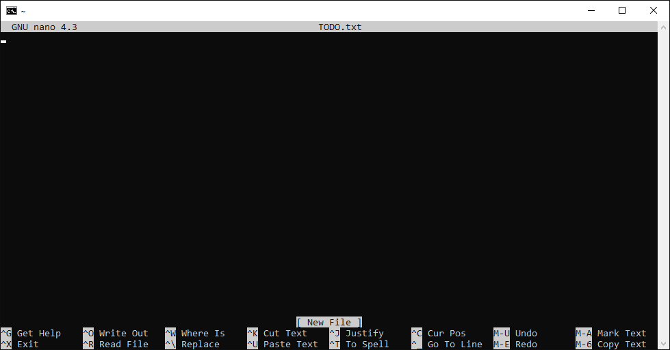
Figure 12. The GNU `nano` editor window right after opening a new file called `TODO.txt`.

At this point you can type the contents of the file. Enter the text exactly as you see in [Figure 13](#fig_nano_editing). Notice that, after your first keystroke, the word “Modified” appears in the upper-right corner; this shows that you have changed the contents of your file but it has not been written to the file system yet. Once you have entered all the text, save the file by pressing `Ctrl+O` (look at the penultimate row, the second command is `^O` which means to “Write Out” the file to the file system).

<a name="fig_nano_editing"></a> 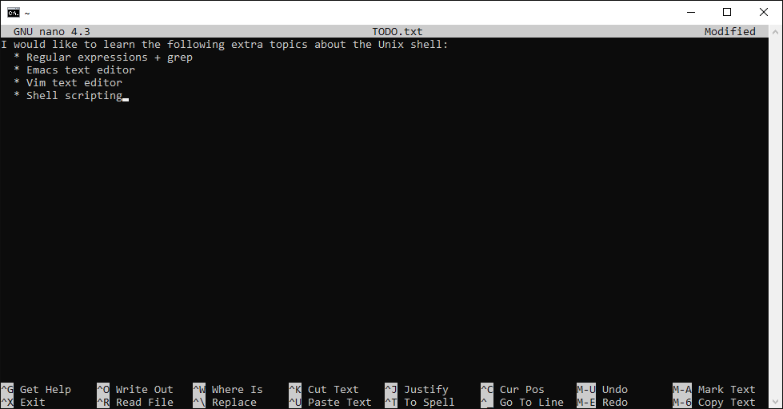
Figure 13. Contents introduced in the `TODO.txt` file using `nano`.

After entering the “WriteOut” (`^O`) command, `nano` will display a prompt on the status line to verify that you really want to write the file contents to the file system. Go ahead and press the `Enter` key, and `nano` will tell you how many lines of text it wrote on the status line. Notice also that the “Modified” indicator in the upper-right corner has disappeared because the file has been saved. At this point you can exit the nano program (`^X`) to go back to the shell prompt.  Now you have written a file, you can take a look at it with `less` or `cat`, or open it up again and edit it with `nano`.

----
> *__Exercise 44:__*
> Open `TODO.txt` and add manually the date of today in `dd/mm/yyyy` format to the top of the file and save the file. Exit `nano`, and check using `cat` that you successfully edited the file.

That is probably enough to get you started. If you would like to get more information about using `nano`, you can type `^G`, and access to the help that it provides. There is comprehensive Documentation on `nano` as well available on the Internet, such as: [nano-editor](https://www.nano-editor.org/docs.php), and [Ubuntu help](https://help.ubuntu.com/community/Nano?action=show&redirect=NanoHowto).


## 1.8. Conclusions and further references
<a id="markdown-conclusions-and-further-references" name="conclusions-and-further-references"></a>

We expect that, after completing this tutorial, you have acquired  fluency with the Unix command-line, and that you have grasped to a large extent the basic concepts underlying it. 
You might feel that the Unix command-line is something old, deprecated, cryptic, and prone to extinction, but nothing could be further from the truth. The reality is that the Unix shell is older than most of the people who use it. And not by chance. It has survived so long because it is one of the most productive task automation environments ever created.
**People that master it are able to automate their work**. Graphical user interfaces may be better at the first, but the shell is still unbeaten at the second.

As a general rule towards command-line excellence, we encourage you to continuously evaluate when working with the Unix command-line how much time a given task is taking. If you feel too much viscosity, i.e., that it is taking too much time because you repeat the same action over and over again, it is much probably because there are ways to automate the task, via, e.g., an smarter command or a suitable written shell script.
This is what mastering the Unix command-line is mostly about.

Of course, this tutorial is only the first step on a long journey towards command-line excellence and scientific coding proficiency. As you proceed on this journey, you will probably discover that learning computer technology is exciting and empowering, but it can also be **hard**. 
Acquiring maturity with computers can be compared to a large extent with
*mathematical maturity*, which consists of the experience and general sophistication needed to understand and write mathematical proofs.
These skills are hard to teach directly, so that you should always be ready to proactively exploit the opportunities given to you in order to improve your computer skills. Over time, the cumulative effect will be that you will have the seemingly magical ability to drive computers towards doing whatever you want them to do.

The Internet is plenty of excellent resources related to the Unix command-line that you can use in order to expand your current skills. 
Indeed this tutorial itself has borrowed many ideas from the excellent material available on the literature. A (by no means comprehensive) list of further references is the following:

- [Learn enough command-line to be dangerous](https://www.learnenough.com/command-line-tutorial/basics) tutorial by [Michael Hart](https://www.michaelhartl.com/)
- [Conquering the Command-line](http://conqueringthecommandline.com/book) book by Mark Bates.
- [The Unix Shell workshop](https://swcarpentry.github.io/shell-novice/) by  Software Carpentry
- [Extra Unix Shell Material](https://carpentries-incubator.github.io/shell-extras/) by Software Carpentry
- Chapter 20 (Unix intro) of ["Introduction to High Performance Scientific Computing"](http://pages.tacc.utexas.edu/~eijkhout/istc/istc.html) book by Victor Eijkhout
- [edX course on Linux](https://www.edx.org/course/introduction-linux-linuxfoundationx-lfs101x-2)
- [Codecademy course on the command line](https://www.codecademy.com/learn/learn-the-command-line)
- [*Learning the Shell*](http://linuxcommand.org/lc3_learning_the_shell.php)
