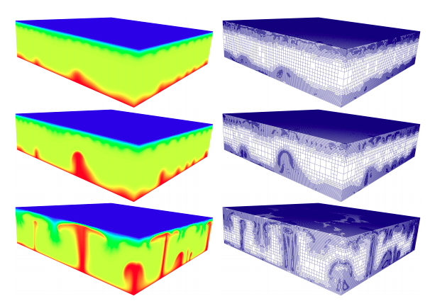
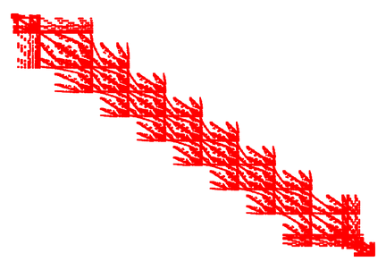

# Computational science

For many centuries, _experiments_ and _theory_ have been the two pillars of science. We make observation and measurements for the phenomena that we want to understand, and then we link these observations with _theories_ (_models_) that agree with these observations and can predict phenomena. Experiments can confirm or refute theories. One recent example is the existence of the _Higgs boson_ that was predicted by theories since the 1970s, but no experiment was able to detect it till 2012.

A new scientific tool has emerged during the last 50 years, which has radically changed how many sciences work. [__Computational science__](https://en.wikipedia.org/wiki/Computational_science) is considered the third pillar of science, and makes use of computational resources to _solve_ (or approximate) complex scientific problems. Computational science certainly benefits from the huge improvements in computational hardware, which allows larger numbers of computations in much reduced time. But, even though these increase in computational power during the last decades has been enormous, the algorithmic improvements by computational scientists have even been more important.

With computational science algorithms, we can predict phenomena that are too expensive, too complex, too dangerous or even impossible to observe in real life. For this reason, computational science is often called _predictive science_. Preliminary designs and optimisation of [aircrafts](https://www.youtube.com/watch?v=-D5N_OnZ_Tg) or F1 cars are carried out in virtual wind tunnels (scientific programs that simulate turbulent flows and structures). The protective shielding of efficient [fusion reactors](https://www.iter.org/mach/Blanket) is also simulated using supercomputers, since there are no experimental facilities in the World to perform these experiments (the ITER project is still in the way). Nowadays, the synergy between experimental, theoretical and computational science is essential for the advancement of science. The importance of computational models is also of critical importance in engineering, and we usually call this area [_computational science and engineering_](https://en.wikipedia.org/wiki/Computational_engineering) or CSE.

CSE is the field that develops _computational models and algorithms_ to simulate phenomena in science and engineering. We can also talk about computational finance or computational sociology to put some examples. It is a quite multidisciplinary field, which involves:

* mathematics, 

* computer science and 

* the branches of science or engineering in which we are applying it (physics, chemistry, biology, etc).

The main ingredients of CSE are mathematical models, numerical methods and (high performance) computational resources.

## Mathematical models

A [mathematical model](https://en.wikipedia.org/wiki/Mathematical_model) that describes the phenomenon we want to simulate. In many cases, the models are continuous (e.g., they involve derivatives and integrals of physical quantities, like the [equations](https://en.wikipedia.org/wiki/Navier%E2%80%93Stokes_equations) that govern a fluid understood as continuum media), in some other cases the problems are discrete (e.g., [molecular models](https://en.wikipedia.org/wiki/Molecular_model)).

## Numerical methods

A [numerical method](https://en.wikipedia.org/wiki/Numerical_analysis) is the branch that replaces mathematical models (after some kind of approximation) into models that can be solved by computers. As we know, computers can only perform basic operations (sum, subtract, multiply, divide, is equal,...). They cannot differentiate or integrate a function, so we must translate (introducing some approximations) complex mathematical models into [_floating point operations_](https://en.wikipedia.org/wiki/Floating-point_arithmetic). This is the science of [_numerical analysis_](https://en.wikipedia.org/wiki/Floating-point_arithmetic) and [_scientific computing_](https://en.wikipedia.org/wiki/Computer_science#Scientific_computing_and_simulation), where researchers replace mathematical models with numerical models (that can be mapped to computers), analyse the well-posedness of these algorithms (e.g., stability) and bound the error performed in this translation (the so-called [_numerical error_](https://en.wikipedia.org/wiki/Numerical_error), how the solution converges to the exact solution as we use more computer resources, etc)

## High performance computer resources

The most complex scientific problems are not been solved in personal computers but supercomputer facilities with millions of processors working together to solve a particular problem. The efficient exploitation of computational resources in scientific applications is also a key aspect of CSE. This area is called __high-performance scientific computing__. 

[Supercomputers](https://en.wikipedia.org/wiki/Supercomputer) involve a huge number of inter-connected processors that can communicate together to solve problems of huge complexity. You can take a look here at the [TOP500](https://www.top500.org/) supercomputers today. As you can see, the largest supercomputers now have about 10 million cores! Australia's largest supercomputer ([Gadi](https://nci.org.au/media/gadi-installation-progress)) is 24th in the World and Japan is [leading](https://www.top500.org/system/179807/) the list now (June 2020). 

## Applications

Applications of CSE can be found in virtually any scientific and engineering discipline (medicine, Earth sciences, biology, aeronautics, etc) and beyond (finance, sociology, etc).

# Example: Partial Differential Equations

Many phenomena in nature are represented by mathematical models that are expressed in terms of [partial differential equations](https://en.wikipedia.org/wiki/Partial_differential_equation) (PDEs): the [Maxwell equations](https://en.wikipedia.org/wiki/Maxwell%27s_equations) for electromagnetism, the [Navier-Stokes equations](https://en.wikipedia.org/wiki/Navier%E2%80%93Stokes_equations) for fluids, the elasticity equations for solids, physical relativity, [Schrödinger equation](https://en.wikipedia.org/wiki/Schr%C3%B6dinger_equation) in quantum mechanics, some cell migration models in living tissues, etc.

Let us consider a very complex problem in geosciences, the _mantle convection_ in the Earth. This natural phenomenon can be stated in terms of a set of partial differential equations:

<a href="https://www.codecogs.com/eqnedit.php?latex=\boldsymbol{\nabla}&space;\cdot&space;\boldsymbol{u}&space;=&space;0&space;\\&space;\boldsymbol{\nabla}&space;p&space;-&space;\boldsymbol{\nabla}\cdot\[&space;\eta(T,\boldsymbol{u})(\boldsymbol{\nabla}\boldsymbol{u}&plus;\boldsymbol{\nabla}\boldsymbol{u}^T)&space;\]&space;=&space;\mathrm{Ra}&space;\,&space;T&space;\,&space;\boldsymbol{e_r}&space;\\&space;\frac{\partial&space;T}{\partial&space;t}&space;&plus;&space;\boldsymbol{u}&space;\cdot&space;\boldsymbol{\nabla}&space;T&space;-&space;\boldsymbol{\nabla}^2T&space;=&space;\gamma." target="_blank"></a>

You don't really need to understand these equations at this stage. Our unknowns are the velocity, pressure, and temperature in the Earth's mantle. These equations are just impossible to solve analytically (unless very simple PDEs on very simple domains). As commented above, computers are not that clever and can just do basic arithmetical and logical operations. To solve PDEs is certainly something computers (but also humans) cannot do in general. As a result we humans have to find models that are _close_ to the differential equations but _only_ involve basic (but probably a huge number!) arithmetic operations that can be carried out by a supercomputer. Thus, what we can do is to _approximate__ the solution of these equations is to _approximate_ it using computers.

Numerical methods for the approximation of PDEs (finite difference, finite element, etc) transform this system of equations into a set of _linear systems_ of equations. In order to do that, in the case of PDE-governed models, numerical methods rely on meshes (e.g., triangulations) that can be found in this [source](http://mathis.colorado.edu/szhong/papers/BursteddeGhattasGurnisEtAl08.pdf). 

Now, the unknowns are not functions but values (velocity, pressure and temperature) at the nodes of this mesh. Thus, our unknown is just an array of real numbers. On the other hand, instead of derivatives of functions, we replace these operators by simple equations. E.g., a derivative 

can be approximated using Taylor's formula. (State-of-the-art numerical methods are much more involved, but this is another story). After this transformation, we are committing an error, but we, numerical analysts, can prove mathematically how these errors are bound, how increasing computational resources (e.g., finer meshes) we tend to the exact solution, etc. 

As a result, the original problem can be rewritten as a (set of) linear systems of equations. Usually, the resulting matrices are very sparse (most entries are zero) and have nice sparsity patterns. A linear system of equations _can be_ solved by a computer; e.g., Gaussian elimination only involves basic operations.

The number of nodes in complex 3D problems (which is related to the number of equations in the resulting linear system) can be __HUGE__; the largest problem so far in PDE-related simulations is $10^13$ equations! Thus, we cannot solve these problems in a personal computer. Instead we have to use so-called supercomputers. The huge improvements in computational power have allowed us scientists solve problems that were impossible years ago. In any case, algorithmic developments have had even more impact on what we can solve now. You can see that the meshes above have different resolution in different areas. These meshes evolve with the solution, in order to capture the smallest details. This way, researchers have been able to reduced about 1000 times the computational cost of these simulations, compared to using a brute force approach with meshes that have same resolution everywhere.

After all this process, we are able to predict mantle convection using computers, as you can see in these [videos](https://aspect.geodynamics.org/gallery.html).

The software libraries that solve PDEs are pretty complex, and can easily involve millions of lines of code. Many of these software libraries are open source, you can take a look at the code, download it for free, use it and even modify it for your needs. Most of these codes can be found in open repository servers like `GitHub`. Here, you can find one of the scientific software projects I lead, [Gridap](https://github.com/gridap/Gridap.jl) and [how to use it](https://github.com/gridap/Tutorials).

In this unit, we do not have the knowledge yet to consider so complex scientific algorithms, but instead, we will go through the basics of scientific programming, and apply these concepts to (far simpler) scientific problems. These are the very same tools that are being used in these more complex applications, and hopefully, all this introduction will motivate you to get into this field. 

If you are interested in numerical methods for differential equations, you could consider enrolling in MTH2051.

